# Tài liệu mô tả logic hệ thống — Module Doctor

> Tài liệu này chỉ mô tả logic hệ thống dựa trên source hiện có. Không chỉnh sửa, refactor hay đổi tên bất kỳ class nào.
> Ứng dụng: `diabetes-manage` (Jakarta Servlet + JSP + MySQL, JDBC thuần, tích hợp Gemini AI).

---

## Thành phần dùng chung

- **Xác thực & phân quyền:** `com.example.diabetesmanage.util.AuthContext`
  - `requireLogin` → chưa đăng nhập thì redirect `/Logincontroller`.
  - `requireDoctor` → chỉ `vai_tro = "bac_si"`; sai thì HTTP 403.
  - `requirePatientDataAccess` → cho phép `bac_si` hoặc `quan_tri_vien`.
  - `scopeDoctorId(user)` → admin trả `null` (xem toàn bộ), bác sĩ trả UUID của mình (giới hạn dữ liệu theo `bac_si_id`).
  - `ensurePatientAccess` / `ensureEncounterAccess` → kiểm tra tồn tại + quyền sở hữu bệnh nhân/lần khám.
- **Layout:** `com.example.diabetesmanage.util.DoctorLayoutHelper.prepare(request, user, activeMenu)` — set attribute cho sidebar/topbar.
- **Kết nối DB:** `com.example.diabetesmanage.context.DBContext.getConnection()` (JDBC MySQL).
- **JSON lâm sàng:** `com.example.diabetesmanage.util.EncounterClinicalJson` — cột `medical_encounters.kham_lam_sang` lưu JSON các chỉ số lâm sàng.
- **Encoding:** `web.xml` cấu hình request/response UTF-8; mọi JSP có `contentType="text/html;charset=UTF-8"`.

### Các bảng/DB objects được toàn module sử dụng

| Đối tượng | Loại | Vai trò |
|---|---|---|
| `users` | bảng | Tài khoản (bác sĩ, bệnh nhân, admin) |
| `patients` | bảng | Hồ sơ bệnh nhân, gắn `bac_si_id`, `user_id` |
| `medical_encounters` | bảng | Lần khám (encounter) |
| `health_records` | bảng | Chỉ số sức khỏe của lần khám nội tiết |
| `lab_results` | bảng | Kết quả xét nghiệm (CBC / sinh hóa) |
| `prescriptions` | bảng | Đơn thuốc + khuyến nghị điều trị |
| `medications` | bảng | Chi tiết từng thuốc trong đơn |
| `appointments` | bảng | Lịch khám |
| `v_patient_summary` | view | Tổng hợp chỉ số mới nhất theo bệnh nhân (dùng cho dashboard) |

---

## A. Danh sách chức năng đã hoàn thành của Doctor

| # | Chức năng | Entry point |
|---|---|---|
| 1 | Tổng quan (Dashboard) | `GET /doctor-dashboard` |
| 2 | Chi tiết bệnh nhân nguy hiểm (phân tích AI) | `POST /doctor-dashboard` |
| 3 | Danh sách bệnh nhân | `GET /doctor/patient-list` |
| 4 | Chi tiết bệnh nhân | `POST /doctor/patient-list` |
| 5 | Danh sách hồ sơ khám bệnh | `GET /doctor/patient-records` |
| 6 | Mở form tạo hồ sơ mới | `POST /doctor/patient-records` (`action=add`) |
| 7 | Phân tích AI (Bước 1) | `POST /doctor/patient-records` (`action=analyze`) |
| 8 | Tạo lần khám / lưu Bước 1 | `POST /doctor/patient-records` (`action=form`) |
| 9 | Xem chi tiết hồ sơ khám | `POST /doctor/patient-records` (`action=detail`) |
| 10 | Xóa hồ sơ khám | `POST /doctor/patient-records` (`action=delete`) |
| 11 | Lập phác đồ điều trị (Bước 2) | `GET` + `POST /doctor/treatment-plan` |
| 12 | Xuất PDF hồ sơ khám | `GET /doctor/record-export-pdf` |
| 13 | Danh sách lịch khám | `GET /doctor/appointments` |
| 14 | Cập nhật trạng thái lịch khám | `POST /doctor/appointments` |

---

## B. Bảng mapping tổng hợp

| Chức năng | Servlet | Service | DAO | Database Tables | JSP |
|---|---|---|---|---|---|
| Dashboard | `DoctorDashboardController` | `DangerousPatientService` | `DoctorDashboardDAO`, `PatientDAO`, (`HealthRecordDAO`, `LabResultDAO` qua service) | `v_patient_summary`, `patients`, `medical_encounters`, `health_records`, `lab_results` | `doctordashboard.jsp` |
| Chi tiết BN nguy hiểm | `DoctorDashboardController` (POST) | `DangerousPatientService` | `PatientDAO`, `HealthRecordDAO`, `LabResultDAO` | `patients`, `health_records`, `lab_results` | `dangerouspatientanalysis.jsp` |
| Danh sách bệnh nhân | `PatientListController` (GET) | — | `PatientDAO` | `v_patient_summary`, `patients`, `users` | `patientmanagement.jsp` |
| Chi tiết bệnh nhân | `PatientListController` (POST) | — | `PatientDAO`, `MedicalEncounterDAO`, `HealthRecordDAO`, `LabResultDAO`, `PrescriptionDAO` | `patients`, `medical_encounters`, `health_records`, `lab_results`, `prescriptions`, `users` | `patientdetail.jsp` |
| Danh sách hồ sơ khám | `MedicalEncounterController` (GET) | — | `MedicalEncounterDAO` | `medical_encounters`, `patients`, `users` | `medicalrecordmanagement.jsp` |
| Mở form tạo hồ sơ | `MedicalEncounterController` (`add`) | — | `PatientDAO` | `patients`, `users` | `add-medical-encounter.jsp` |
| Phân tích AI Bước 1 | `MedicalEncounterController` (`analyze`) | `MedicalEncounterCreateService`, `EncounterAiAnalysis` | `PatientDAO` | `patients` (đọc) + Gemini API | JSON (không forward JSP) |
| Tạo lần khám Bước 1 | `MedicalEncounterController` (`form`) | `MedicalEncounterCreateService` | `MedicalEncounterDAO`, `PatientDAO`, `PrescriptionDAO`, `MedicationDAO`, `LabResultDAO`, `HealthRecordDAO` | `medical_encounters`, `patients`, `prescriptions`, `medications`, `lab_results`, `health_records` | redirect (PRG) |
| Xem chi tiết hồ sơ | `MedicalEncounterController` (`detail`) | `MedicalRecordViewService` | `MedicalEncounterDAO`, `PatientDAO`, `HealthRecordDAO`, `LabResultDAO`, `PrescriptionDAO`, `MedicationDAO`, `UserDAO` | `medical_encounters`, `patients`, `health_records`, `lab_results`, `prescriptions`, `medications`, `users` | `medicalrecorddetail.jsp` |
| Xóa hồ sơ | `MedicalEncounterController` (`delete`) | — | `MedicalEncounterDAO`, `PrescriptionDAO`, `MedicationDAO`, `LabResultDAO`, `HealthRecordDAO` | `medical_encounters`, `prescriptions`, `medications`, `lab_results`, `health_records` | redirect (PRG) |
| Phác đồ điều trị Bước 2 | `TreatmentPlanController` | — (logic `save()` trong controller) | `MedicalEncounterDAO`, `PatientDAO`, `PrescriptionDAO`, `MedicationDAO` | `medical_encounters`, `patients`, `prescriptions`, `medications` | `treatment-plan.jsp` |
| Xuất PDF | `MedicalRecordPdfExportController` | `MedicalRecordViewService`, `MedicalRecordPdfService` | `MedicalEncounterDAO`, `PatientDAO` (+ các DAO trong view service) | `medical_encounters`, `patients`, `health_records`, `lab_results`, `prescriptions`, `medications`, `users` | trả file PDF (`application/pdf`) |
| Danh sách lịch khám | `DoctorAppointmentController` (GET) | — | `AppointmentDAO` | `appointments`, `patients`, `users` | `doctorappointmentmanagement.jsp` |
| Cập nhật lịch khám | `DoctorAppointmentController` (POST) | — | `AppointmentDAO` | `appointments`, `patients` | redirect (PRG) |

---

## Chi tiết từng chức năng

### 1. Tổng quan (Dashboard)

1. **Mục đích:** Hiển thị thống kê tổng quan của bác sĩ (số bệnh nhân, phân bố mức nguy cơ theo đường huyết, số cảnh báo, số lần khám hôm nay) và danh sách bệnh nhân nguy hiểm kèm phân tích AI.
2. **Thao tác người dùng:** Bác sĩ đăng nhập → mở menu "Tổng quan". Có thể lọc theo `startDate`, `endDate`.
3. **Luồng:** `GET /doctor-dashboard` → `DoctorDashboardController.doGet` → `DoctorDashboardDAO.getDashboardStats` + `DangerousPatientService.analyzeDangerousPatients` → `PatientDAO`/`HealthRecordDAO`/`LabResultDAO` → MySQL/`v_patient_summary` → `doctordashboard.jsp`.
4. **Validation:** `AuthContext.requireDoctor` (chỉ bác sĩ). Không validate dữ liệu nhập vì chỉ đọc.
5. **Business logic:** `DoctorDashboardDAO` phân nhóm nguy cơ theo ngưỡng đường huyết (<140 / 140–179 / 180–249 / ≥250). `DangerousPatientService` chấm điểm rủi ro theo quy tắc y khoa + gọi Gemini để tạo insight; đếm số bệnh nhân `critical`.
6. **Transaction:** Không có (chỉ đọc, mỗi truy vấn tự đóng connection).
7. **Bảng dùng:** `v_patient_summary`, `patients`, `medical_encounters`, `health_records`, `lab_results`.
8. **DTO/Model:** `DashboardSummaryDTO`, `CriticalPatientAlertDTO`, `DangerousPatientService.AnalysisResult`, `Patient`, `HealthRecord`, `LabResult`, `User`.
9. **Service:** `DangerousPatientService`.
10. **DAO:** `DoctorDashboardDAO`, `PatientDAO` (+ `HealthRecordDAO`, `LabResultDAO` qua service).
11. **Dữ liệu lưu:** Không lưu (read-only).
12. **Lỗi:** Chưa đăng nhập → redirect login; không phải bác sĩ → 403. Lỗi SQL của stats → fallback `loadStatsWithoutAlertsColumn`; lỗi Gemini → fallback quy tắc.
13. **Thành công:** Forward `doctordashboard.jsp` với đầy đủ số liệu.
14. **Trả JSP:** `stats`, `urgentPatients`, `analysisResult`.

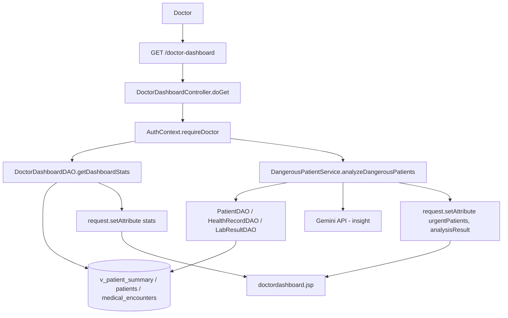

---

### 2. Chi tiết bệnh nhân nguy hiểm (phân tích AI)

1. **Mục đích:** Xem phân tích chuyên sâu (AI hoặc quy tắc) cho một bệnh nhân nguy hiểm được chọn từ dashboard.
2. **Thao tác:** Nhấn vào một bệnh nhân trong danh sách cảnh báo → submit POST `id` (patientId).
3. **Luồng:** `POST /doctor-dashboard` → `DoctorDashboardController.doPost` → `DangerousPatientService.getDangerousPatientDetail` → `PatientDAO`/`HealthRecordDAO` → MySQL + Gemini → `dangerouspatientanalysis.jsp`.
4. **Validation:** `requireDoctor` + `ensurePatientAccess` (tồn tại + thuộc quyền). Thiếu `id` → redirect về dashboard.
5. **Business logic:** `buildRiskProfile` + `analyzeRiskRules` chấm điểm; nếu không nguy hiểm → trả `null`; gọi `analyzePatientDetail` (Gemini) hoặc fallback quy tắc.
6. **Transaction:** Không có.
7. **Bảng dùng:** `patients`, `health_records`, `lab_results`.
8. **DTO/Model:** `HighRiskPatientDTO`, `PatientRiskAssessmentDTO`, `Patient`, `HealthRecord`.
9. **Service:** `DangerousPatientService`.
10. **DAO:** `PatientDAO`, `HealthRecordDAO`, `LabResultDAO`.
11. **Dữ liệu lưu:** Không lưu.
12. **Lỗi:** Thiếu id / không truy cập được / `detail == null` → redirect `/doctor-dashboard`.
13. **Thành công:** Forward `dangerouspatientanalysis.jsp` với `detail`.
14. **Trả JSP:** `detail` (`HighRiskPatientDTO`).

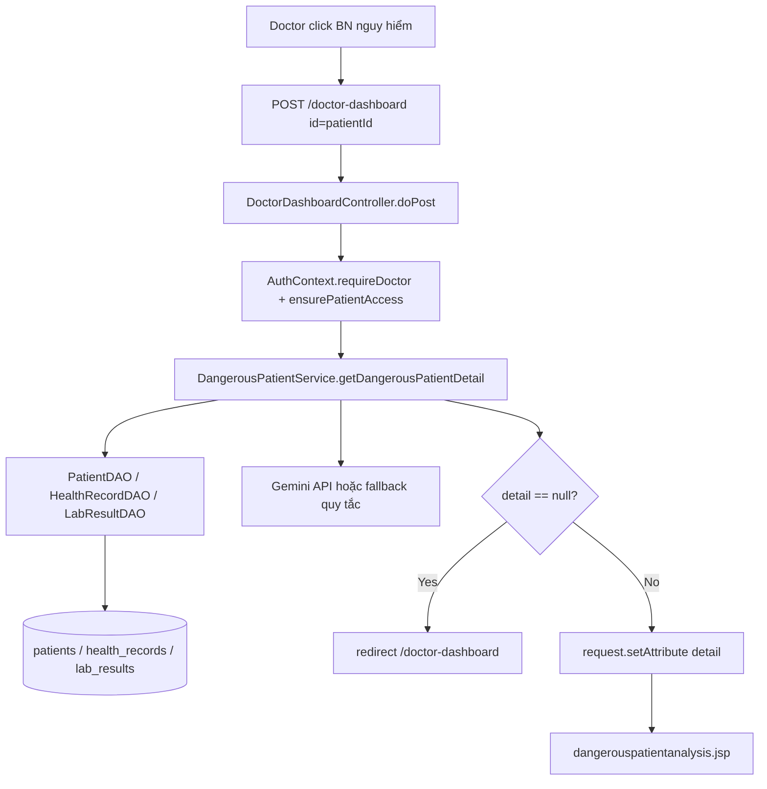

---

### 3. Danh sách bệnh nhân

1. **Mục đích:** Liệt kê & lọc bệnh nhân theo từ khóa, đường huyết, HbA1c, BMI, hành động.
2. **Thao tác:** Mở menu "Danh sách bệnh nhân"; nhập bộ lọc `keyword/glucose/hba1c/bmi/action`.
3. **Luồng:** `GET /doctor/patient-list` → `PatientListController.doGet` → `PatientDAO.searchPatients` → `v_patient_summary`/`patients`/`users` → `patientmanagement.jsp`.
4. **Validation:** `requirePatientDataAccess` (bác sĩ hoặc admin). Bộ lọc không bắt buộc.
5. **Business logic:** `PatientDAO.searchPatients` ghép điều kiện lọc động; giới hạn theo `scopeDoctorId`.
6. **Transaction:** Không có.
7. **Bảng dùng:** `v_patient_summary`, `patients`, `users`.
8. **DTO/Model:** `Patient`, `User`.
9. **Service:** Không.
10. **DAO:** `PatientDAO`.
11. **Dữ liệu lưu:** Không lưu.
12. **Lỗi:** Không đủ quyền → 403.
13. **Thành công:** Forward `patientmanagement.jsp`.
14. **Trả JSP:** `patients`.

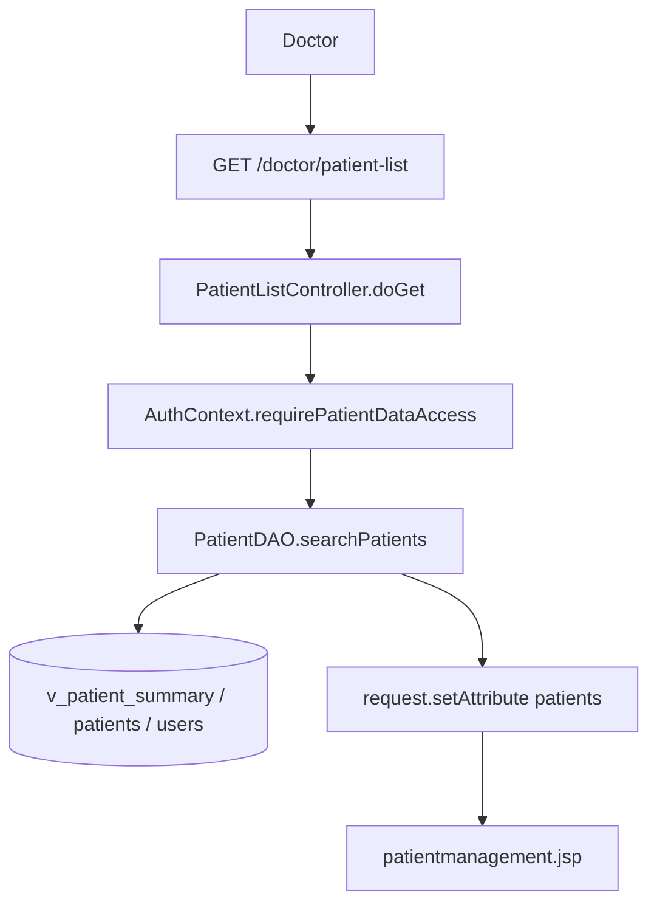

---

### 4. Chi tiết bệnh nhân

1. **Mục đích:** Hiển thị hồ sơ tổng quan của một bệnh nhân: chỉ số mới nhất + tổng hợp lâm sàng từ nhiều nguồn.
2. **Thao tác:** Nhấn 1 bệnh nhân trong danh sách → POST `id`.
3. **Luồng:** `POST /doctor/patient-list` → `PatientListController.doPost` → `PatientDAO` + `MedicalEncounterDAO` + `HealthRecordDAO` + `LabResultDAO` + `PrescriptionDAO` → MySQL → `patientdetail.jsp`.
4. **Validation:** `requirePatientDataAccess` + `ensurePatientAccess`. Thiếu `id` → redirect `/doctor/patient-list`.
5. **Business logic:** `enrichClinicalFields` gộp chỉ số mới nhất từng loại (encounter cũ + mới), lấy triệu chứng/khám lâm sàng/chẩn đoán từ lịch sử encounter (lùi dần), lấy khuyến nghị từ đơn thuốc; parse JSON `kham_lam_sang`.
6. **Transaction:** Không có (nhiều truy vấn đọc độc lập).
7. **Bảng dùng:** `patients`, `medical_encounters`, `health_records`, `lab_results`, `prescriptions`, `users`.
8. **DTO/Model:** `Patient`, `MedicalEncounter`, `HealthRecord`, `LabResult`, `User`.
9. **Service:** Không.
10. **DAO:** `PatientDAO`, `MedicalEncounterDAO`, `HealthRecordDAO`, `LabResultDAO`, `PrescriptionDAO`.
11. **Dữ liệu lưu:** Không lưu.
12. **Lỗi:** Thiếu id → redirect; không đủ quyền → 403/404.
13. **Thành công:** Forward `patientdetail.jsp`.
14. **Trả JSP:** `patient`, `encounter`, `healthRecord`, `hasHealthRecord`, `currentUser`.

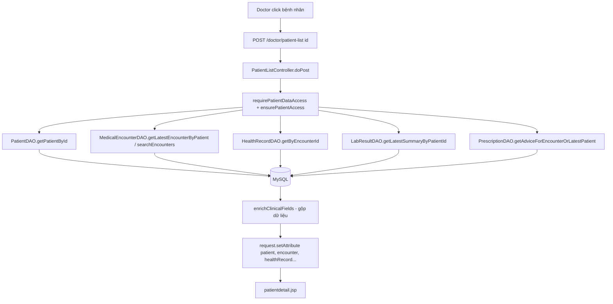

---

### 5. Danh sách hồ sơ khám bệnh

1. **Mục đích:** Liệt kê & lọc các lần khám (encounter).
2. **Thao tác:** Mở menu "Hồ sơ khám bệnh"; lọc `startDate/endDate/keyword/type/status/patientId`.
3. **Luồng:** `GET /doctor/patient-records` → `MedicalEncounterController.doGet` → `MedicalEncounterDAO.searchEncounters` → MySQL → `medicalrecordmanagement.jsp`.
4. **Validation:** `requirePatientDataAccess`.
5. **Business logic:** `searchEncounters` ghép filter động, scope theo bác sĩ.
6. **Transaction:** Không có.
7. **Bảng dùng:** `medical_encounters`, `patients`, `users`.
8. **DTO/Model:** `MedicalEncounter`, `User`.
9. **Service:** Không.
10. **DAO:** `MedicalEncounterDAO`.
11. **Dữ liệu lưu:** Không lưu.
12. **Lỗi:** Không đủ quyền → 403.
13. **Thành công:** Forward `medicalrecordmanagement.jsp`.
14. **Trả JSP:** `records`, `patientId`.

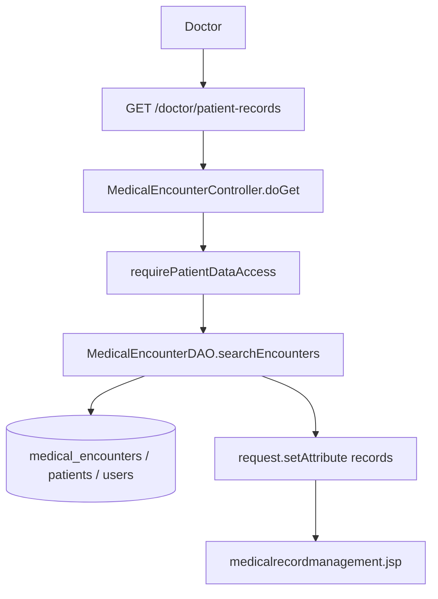

---

### 6. Mở form tạo hồ sơ mới (`action=add`)

1. **Mục đích:** Hiển thị form trống để tạo lần khám mới (mặc định ngày hôm nay, khoa Nội tiết).
2. **Thao tác:** Nhấn "Tạo hồ sơ mới" ở sidebar (POST `action=add`).
3. **Luồng:** `POST /doctor/patient-records` (`add`) → `add()` → `PatientDAO.getPatients` → `add-medical-encounter.jsp`.
4. **Validation:** `requireDoctor`.
5. **Business logic:** Khởi tạo `EncounterCreateDTO`, set `ngayKham`, `khoaKham`; nạp danh sách bệnh nhân; nếu chọn sẵn bệnh nhân thì auto-fill chiều cao.
6. **Transaction:** Không có.
7. **Bảng dùng:** `patients`, `users`.
8. **DTO/Model:** `EncounterCreateDTO`, `Patient`.
9. **Service:** Không.
10. **DAO:** `PatientDAO`.
11. **Dữ liệu lưu:** Không lưu.
12. **Lỗi:** Không phải bác sĩ → 403.
13. **Thành công:** Forward form.
14. **Trả JSP:** `form`, `patients`, (`patient` nếu có).

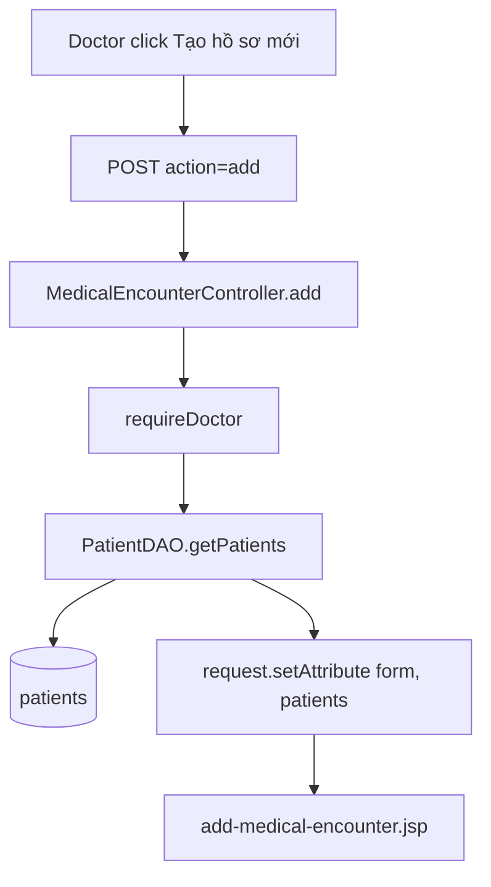

---

### 7. Phân tích AI Bước 1 (`action=analyze`)

1. **Mục đích:** Gọi AI phân tích nhanh dữ liệu form trước khi lưu, trả JSON cho frontend (AJAX).
2. **Thao tác:** Trên form tạo hồ sơ, nhấn nút "Phân tích AI"; JS gửi POST `action=analyze`.
3. **Luồng:** `POST /doctor/patient-records` (`analyze`) → `analyze()` → `MedicalEncounterCreateService.validateStep1` → `EncounterAiAnalysis.analyze` (Gemini/quy tắc) → trả JSON.
4. **Validation:** Ép kiểu số (`NumberFormatException` → trả lỗi JSON); `validateStep1`; kiểm tra bệnh nhân tồn tại.
5. **Business logic:** `EncounterAiAnalysis` build prompt, gọi Gemini; lỗi/không cấu hình → fallback quy tắc y khoa.
6. **Transaction:** Không có (không ghi DB).
7. **Bảng dùng:** `patients` (đọc) + Gemini API bên ngoài.
8. **DTO/Model:** `EncounterCreateDTO`, `Patient`, `EncounterAiAnalysis`.
9. **Service:** `MedicalEncounterCreateService`, `EncounterAiAnalysis`.
10. **DAO:** `PatientDAO`.
11. **Dữ liệu lưu:** Không lưu.
12. **Lỗi:** Lỗi số / validate / không tìm thấy bệnh nhân → JSON `{ok:false, errors:[...]}` (HTTP 200).
13. **Thành công:** JSON `{ok:true, ai:{...}, summaryText:...}`.
14. **Trả JSP:** Không (ghi JSON qua `Gson`).

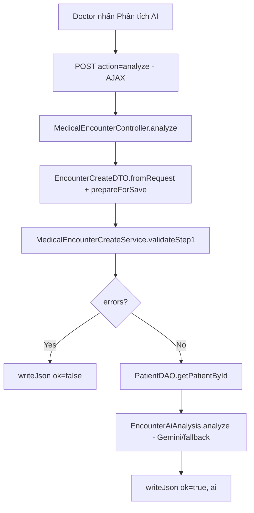

---

### 8. Tạo lần khám / lưu Bước 1 (`action=form`)

1. **Mục đích:** Validate và lưu lần khám mới theo loại hồ sơ (tái khám nội tiết / máu tổng quát / sinh hóa máu).
2. **Thao tác:** Điền form và nhấn "Lưu/Tiếp tục".
3. **Luồng:** `POST /doctor/patient-records` (`form`) → `form()` → `MedicalEncounterCreateService.create` → `MedicalEncounterDAO`/`PatientDAO`/`PrescriptionDAO`/`MedicationDAO`/`LabResultDAO`/`HealthRecordDAO` → MySQL → redirect.
4. **Validation:** Ép kiểu số; bắt buộc chọn bệnh nhân; xác định bác sĩ; `ensurePatientAccess`; `validateStep1`; trong service còn `requirePatientUuid/requireDoctorUuid`, `validateEndocrineInsertFields`, `encounterDAO.validateInsertFields`.
5. **Business logic:** `create()` chuẩn hóa form (`prepareForSave`: tính BMI, đồng bộ lab→chỉ số), đặt placeholder `"Đang cập nhật"` cho `chan_doan_chinh` (NOT NULL) với hồ sơ nội tiết; ghi dữ liệu theo loại hồ sơ.
6. **Transaction:** **Bắt đầu** ở `MedicalEncounterCreateService.create` (`con.setAutoCommit(false)`); **commit** sau khi ghi đủ; **rollback** nếu `SQLException`; `finally` khôi phục autoCommit + đóng connection.
7. **Bảng dùng:** `medical_encounters` (luôn); + theo loại: `health_records`, `prescriptions`, `medications` (nội tiết), `lab_results` (máu tổng quát/sinh hóa); `patients` (update `loai_tieu_duong`).
8. **DTO/Model:** `EncounterCreateDTO` (+ `MedicationLineItem`), `MedicalEncounter`, `CreateResult`.
9. **Service:** `MedicalEncounterCreateService`.
10. **DAO:** `MedicalEncounterDAO`, `PatientDAO`, `PrescriptionDAO`, `MedicationDAO`, `LabResultDAO`, `HealthRecordDAO`.
11. **Dữ liệu lưu:** `medical_encounters` + (`health_records`/`prescriptions`/`medications` hoặc `lab_results`), cập nhật `patients.loai_tieu_duong`.
12. **Lỗi:** Lỗi số/validate → forward lại form kèm `errors`/`fieldErrors`; `SQLException` → rollback + forward form báo lỗi.
13. **Thành công:** Nội tiết → redirect `/doctor/treatment-plan?id=...` (Bước 2); hồ sơ máu → redirect `/doctor/patient-records?success=1`.
14. **Trả JSP:** Khi lỗi: `add-medical-encounter.jsp` (`form`, `errors`, `fieldErrors`, `patients`). Khi thành công: redirect (PRG).

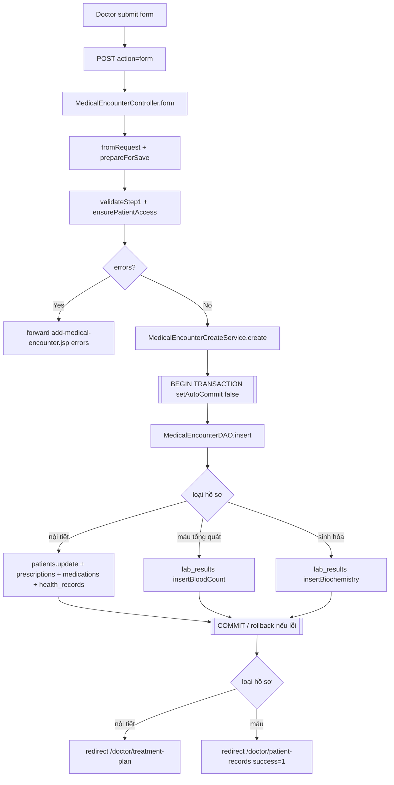

---

### 9. Xem chi tiết hồ sơ khám (`action=detail`)

1. **Mục đích:** Hiển thị chi tiết đầy đủ một lần khám (chỉ số, chẩn đoán, đơn thuốc, xét nghiệm) theo loại hồ sơ.
2. **Thao tác:** Nhấn "Xem" trên danh sách hồ sơ → POST `action=detail`, `id`.
3. **Luồng:** `POST /doctor/patient-records` (`detail`) → `viewDetail()` → `MedicalRecordViewService.loadDetailViewByEncounterId` → nhiều DAO → MySQL → `medicalrecorddetail.jsp`.
4. **Validation:** `requirePatientDataAccess` + `ensureEncounterAccess`; thiếu id → redirect; không tìm thấy → 404.
5. **Business logic:** `MedicalRecordViewService` build DTO theo loại encounter (nội tiết / CBC / sinh hóa), tô cảnh báo bất thường (glucose/HbA1c/huyết áp/lipid...), chuyển đổi đơn vị Creatinine.
6. **Transaction:** Không có.
7. **Bảng dùng:** `medical_encounters`, `patients`, `health_records`, `lab_results`, `prescriptions`, `medications`, `users`.
8. **DTO/Model:** `MedicalEncounterDTO` (+ các Section), `MedicalEncounter`, `Patient`, `HealthRecord`, `LabResult`.
9. **Service:** `MedicalRecordViewService`.
10. **DAO:** `MedicalEncounterDAO`, `PatientDAO`, `HealthRecordDAO`, `LabResultDAO`, `PrescriptionDAO`, `MedicationDAO`, `UserDAO`.
11. **Dữ liệu lưu:** Không lưu.
12. **Lỗi:** Thiếu id → redirect; không thấy encounter/detailView → 404.
13. **Thành công:** Forward `medicalrecorddetail.jsp`.
14. **Trả JSP:** `encounter`, `detailView`.

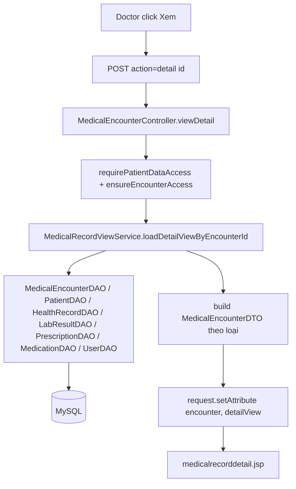

---

### 10. Xóa hồ sơ khám (`action=delete`)

1. **Mục đích:** Xóa hoàn toàn một lần khám và toàn bộ dữ liệu liên quan.
2. **Thao tác:** Nhấn "Xóa" → POST `action=delete`, `id`.
3. **Luồng:** `POST /doctor/patient-records` (`delete`) → `delete()` → `deleteEncounterById()` → nhiều DAO delete → MySQL → redirect.
4. **Validation:** `requirePatientDataAccess` + `ensureEncounterAccess`; thiếu id → redirect `?error=missing_id`.
5. **Business logic:** Xóa theo thứ tự phụ thuộc khóa ngoại: medications → prescriptions → lab_results → health_records → medical_encounters.
6. **Transaction:** **Bắt đầu** trong `deleteEncounterById` (`setAutoCommit(false)`); **commit** sau khi xóa hết; **rollback** nếu `SQLException`; `finally` khôi phục autoCommit + đóng connection.
7. **Bảng dùng:** `medications`, `prescriptions`, `lab_results`, `health_records`, `medical_encounters`.
8. **DTO/Model:** `MedicalEncounter`.
9. **Service:** Không (logic trong controller).
10. **DAO:** `PrescriptionDAO`, `MedicationDAO`, `LabResultDAO`, `HealthRecordDAO`, `MedicalEncounterDAO`.
11. **Dữ liệu lưu:** Xóa dữ liệu ở 5 bảng trên.
12. **Lỗi:** `SQLException` → rollback + redirect `?error=delete`.
13. **Thành công:** Redirect `?deleted=1`.
14. **Trả JSP:** Redirect (PRG).

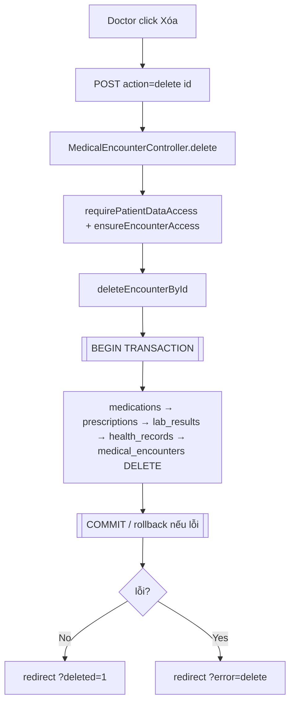

---

### 11. Lập phác đồ điều trị — Bước 2 (`/doctor/treatment-plan`)

1. **Mục đích:** Hoàn thiện chẩn đoán chính/phụ, hướng xử trí và kê đơn thuốc cho lần khám nội tiết đã tạo ở Bước 1.
2. **Thao tác:** Sau khi lưu Bước 1 (nội tiết), hệ thống redirect sang trang này (`GET ?id=`). Bác sĩ điền chẩn đoán + thuốc rồi submit (`POST`).
3. **Luồng:** `GET` → `renderForm` (hiển thị dữ liệu cũ + tóm tắt AI từ session). `POST` → validate → `save()` → `MedicalEncounterDAO`/`PatientDAO`/`PrescriptionDAO`/`MedicationDAO` → MySQL → redirect.
4. **Validation:** `requireDoctor` (+ `ensureEncounterAccess` ở POST); `NumberFormatException` cho số ngày dùng thuốc; bắt buộc `Chẩn đoán chính`; mỗi thuốc cần `Liều lượng` + `Tần suất`; số ngày ≥ 0.
5. **Business logic:** `save()` cập nhật phác đồ, cập nhật `loai_tieu_duong` (nếu có), **xóa đơn thuốc cũ rồi tạo lại** (medications + prescriptions) khi có dữ liệu đơn.
6. **Transaction:** **Bắt đầu** trong `save()` (`setAutoCommit(false)`); **commit** sau khi update + xóa + insert; **rollback** nếu `SQLException`; `finally` khôi phục autoCommit; connection tự đóng (try-with-resources).
7. **Bảng dùng:** `medical_encounters` (update), `patients` (update), `prescriptions` (delete+insert), `medications` (delete+insert).
8. **DTO/Model:** `EncounterCreateDTO` (+ `MedicationLineItem`), `MedicalEncounter`, `Patient`.
9. **Service:** Không (logic `save()` nằm trong controller).
10. **DAO:** `MedicalEncounterDAO`, `PatientDAO`, `PrescriptionDAO`, `MedicationDAO`.
11. **Dữ liệu lưu:** `medical_encounters` (chẩn đoán/hướng xử trí), `patients.loai_tieu_duong`, `prescriptions`, `medications`.
12. **Lỗi:** Không thấy encounter → redirect `/doctor/patient-records?error=`; lỗi validate → `renderFormWithError`; `SQLException` → rollback + render form kèm lỗi.
13. **Thành công:** Redirect `/doctor/patient-records?success=1&patientId=...`; xóa `aiSummary` khỏi session.
14. **Trả JSP:** `treatment-plan.jsp` (`encounter`, `patient`, `advice`, `meds`, `currentDiagnosis`, `aiSummary`; lỗi thêm `errors`/`fieldErrors`).

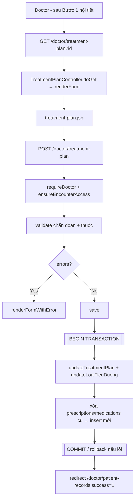

---

### 12. Xuất PDF hồ sơ khám (`/doctor/record-export-pdf`)

1. **Mục đích:** Xuất file PDF của một lần khám theo loại xuất (`type`).
2. **Thao tác:** Nhấn "Xuất PDF" trên trang chi tiết → `GET ?id=&type=`.
3. **Luồng:** `GET` → `MedicalRecordPdfExportController.doGet` → `MedicalRecordViewService.loadDetailViewByEncounterId` → `MedicalRecordPdfService.generateMedicalRecordPdf` → trả bytes PDF.
4. **Validation:** `requirePatientDataAccess` + `ensureEncounterAccess`; thiếu id → 400; không thấy view → 404.
5. **Business logic:** Build view DTO (như chức năng 9) rồi render PDF (OpenPDF); đặt tên file an toàn.
6. **Transaction:** Không có.
7. **Bảng dùng:** `medical_encounters`, `patients`, `health_records`, `lab_results`, `prescriptions`, `medications`, `users`.
8. **DTO/Model:** `MedicalEncounterDTO`, `PdfExportType`.
9. **Service:** `MedicalRecordViewService`, `MedicalRecordPdfService`.
10. **DAO:** `MedicalEncounterDAO`, `PatientDAO` (+ DAO trong view service).
11. **Dữ liệu lưu:** Không lưu.
12. **Lỗi:** Thiếu id → 400; không thấy hồ sơ → 404; lỗi tạo PDF → 500.
13. **Thành công:** Trả `application/pdf` (attachment).
14. **Trả JSP:** Không (ghi binary PDF vào response).

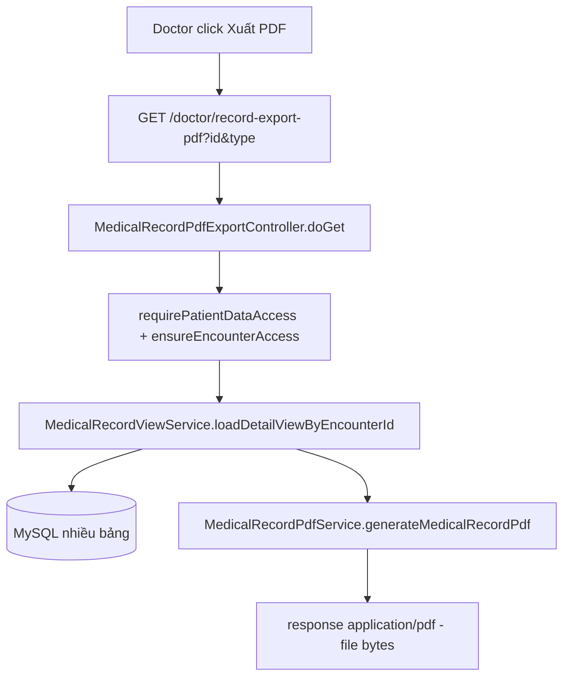

---

### 13. Danh sách lịch khám (`GET /doctor/appointments`)

1. **Mục đích:** Xem & lọc lịch khám theo trạng thái/từ khóa/khoảng ngày.
2. **Thao tác:** Mở menu "Quản lý lịch khám"; lọc `status/keyword/fromDate/toDate`.
3. **Luồng:** `GET` → `DoctorAppointmentController.doGet` → `AppointmentDAO.findAll` → MySQL → `doctorappointmentmanagement.jsp`.
4. **Validation:** `requirePatientDataAccess`; chuẩn hóa `status` qua `Appointment.normalizeStatusFilter`.
5. **Business logic:** `findAll` ghép filter động, scope theo bác sĩ; có `findAllFallback` khi query chính lỗi.
6. **Transaction:** Không có.
7. **Bảng dùng:** `appointments`, `patients`, `users`.
8. **DTO/Model:** `Appointment`, `User`.
9. **Service:** Không.
10. **DAO:** `AppointmentDAO`.
11. **Dữ liệu lưu:** Không lưu.
12. **Lỗi:** Không đủ quyền → 403.
13. **Thành công:** Forward `doctorappointmentmanagement.jsp`.
14. **Trả JSP:** `appointments`.

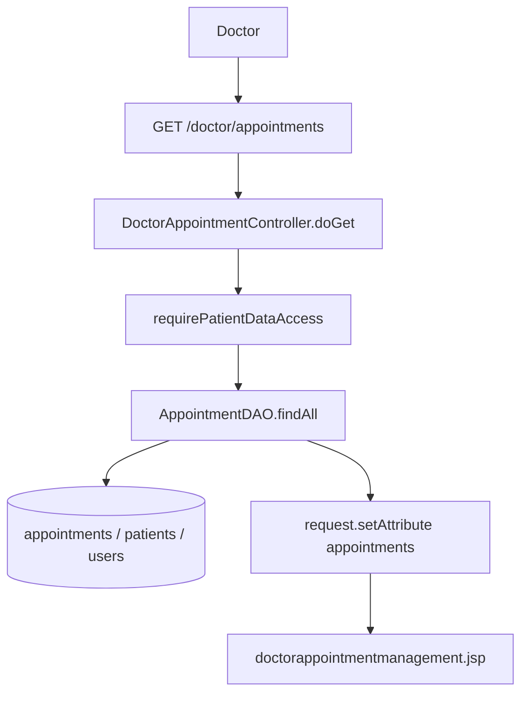

---

### 14. Cập nhật trạng thái lịch khám (`POST /doctor/appointments`)

1. **Mục đích:** Đánh dấu lịch "Đã khám" hoặc "Hủy".
2. **Thao tác:** Nhấn nút trạng thái trên 1 dòng lịch → POST `id`, `status`, (`filterStatus`).
3. **Luồng:** `POST` → `DoctorAppointmentController.doPost` → `AppointmentDAO.updateStatus`/`findById` → MySQL → redirect.
4. **Validation:** `requireDoctor`; chuẩn hóa status; chỉ cho phép `STATUS_DA_KHAM` / `STATUS_HUY`; `markCompleted` chỉ áp dụng khi trạng thái hiện tại là `STATUS_CHO_KHAM`.
5. **Business logic:** `markCompleted` kiểm tra trạng thái hiện tại trước khi update; hủy thì update trực tiếp.
6. **Transaction:** Không quản lý transaction tường minh (update đơn lẻ, auto-commit).
7. **Bảng dùng:** `appointments` (+ `patients` trong câu update có JOIN scope).
8. **DTO/Model:** `Appointment`.
9. **Service:** Không.
10. **DAO:** `AppointmentDAO`.
11. **Dữ liệu lưu:** `appointments.trang_thai`.
12. **Lỗi:** Trạng thái không hợp lệ / không cập nhật được → HTTP 400.
13. **Thành công:** Redirect `/doctor/appointments?...&updated=1`.
14. **Trả JSP:** Redirect (PRG).

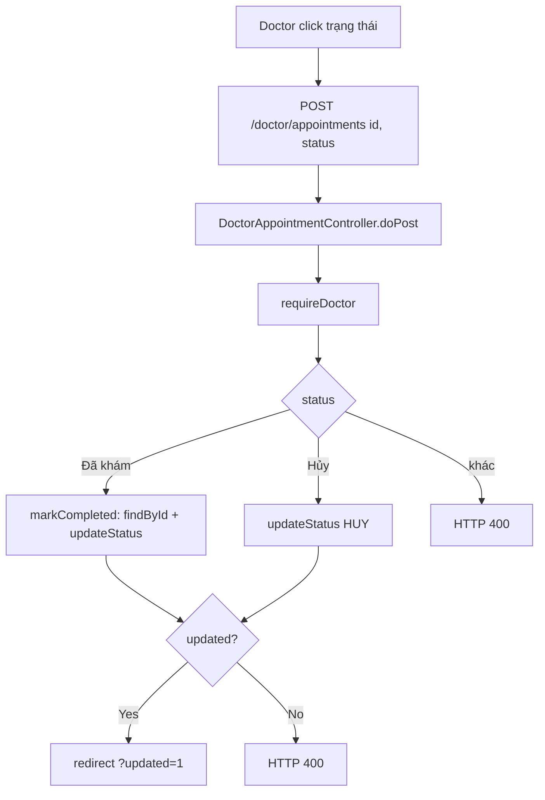

---

## Sơ đồ tổng thể module Doctor

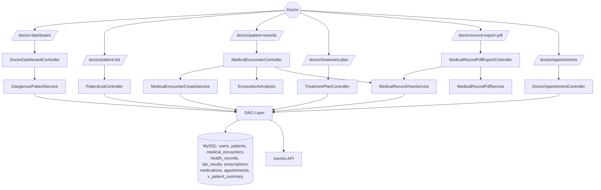

---

## C. Chức năng còn TODO / chưa hoàn thiện

> Nhận định dựa trên source hiện tại (không sửa code).

1. **"Cảnh báo khẩn cấp" (menu `alerts`):** Trong `sidebar.jsp` mục này **không có `href`** — không có trang danh sách cảnh báo độc lập. Chi tiết bệnh nhân nguy hiểm hiện chỉ mở qua `POST /doctor-dashboard` từ dashboard, chưa có màn hình danh sách cảnh báo riêng.
2. **"Phân tích dữ liệu" (menu `analytics`):** Trong `sidebar.jsp` **không có `href`** và không có servlet/JSP tương ứng → chưa triển khai.
3. **Chỉnh sửa hồ sơ khám (update encounter):** Có `LabResultDAO`/`HealthRecordDAO` từng có method `update` (đã bị gỡ ở đợt cleanup); Bước 2 (`treatment-plan`) hiện xử lý cập nhật bằng cách **xóa và tạo lại** đơn thuốc, chưa có chức năng edit đầy đủ toàn bộ encounter (chỉ số sinh hiệu / lab) sau khi tạo.
4. **`MedicalEncounterDAO.updateTreatmentPlan`** chỉ cập nhật chẩn đoán/hướng xử trí ở Bước 2; không có luồng UI cho phép sửa lại các chỉ số `health_records`/`lab_results` đã lưu.
5. **Nút "Hỗ trợ" trong sidebar** trỏ `href="#"` — placeholder, chưa có nội dung.
6. **Đặt lịch khám (tạo mới appointment) cho bác sĩ:** Module `appointments` hiện chỉ hỗ trợ **xem danh sách** và **đổi trạng thái** (đã khám/hủy); chưa thấy luồng tạo mới/sửa lịch từ phía bác sĩ.
7. **`HelloServlet` (`/hello-servlet`):** Servlet mẫu còn sót lại, không thuộc nghiệp vụ Doctor (không nằm trong sidebar), có thể xem là rác kỹ thuật.

---

## Ghi chú về Transaction (tổng hợp)

| Chức năng | Có transaction? | Bắt đầu | Kết thúc |
|---|---|---|---|
| Tạo lần khám (Bước 1) | Có | `MedicalEncounterCreateService.create` (`setAutoCommit(false)`) | `commit` / `rollback` + khôi phục autoCommit + `close` |
| Lập phác đồ (Bước 2) | Có | `TreatmentPlanController.save` (`setAutoCommit(false)`) | `commit` / `rollback` + khôi phục autoCommit (try-with-resources đóng connection) |
| Xóa hồ sơ khám | Có | `MedicalEncounterController.deleteEncounterById` (`setAutoCommit(false)`) | `commit` / `rollback` + khôi phục autoCommit + `close` |
| Cập nhật trạng thái lịch | Không (auto-commit) | — | — |
| Các chức năng đọc (dashboard, danh sách, chi tiết, PDF) | Không | — | — |
