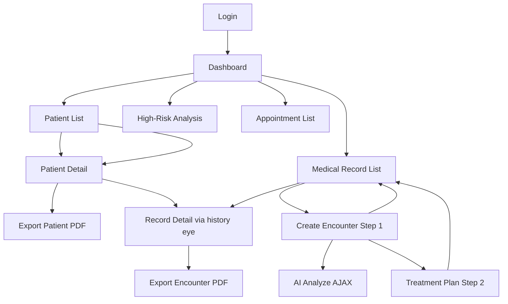

# Doctor Module — Mockup Design Documentation

> **Mục đích:** Tài liệu mockup UI cho báo cáo Software Engineering / SRS.  
> **Nguyên tắc:** Chỉ mô tả màn hình và thành phần **đã implement** trong source (`WEB-INF/views/doctor/`, `auth/login.jsp`).  
> **Brand:** HealthAlert / Diabetes Support System — layout Sidebar + Topbar, font Inter, primary `#1557d5`.

---

## Mục lục

1. [Doctor Navigation Structure](#1-doctor-navigation-structure)
2. [UI Design Guidelines](#2-ui-design-guidelines)
3. [Danh sách màn hình (Screen Inventory)](#3-danh-sách-màn-hình-screen-inventory)
4. [Mockup từng màn hình](#4-mockup-từng-màn-hình)
5. [Phụ lục — Điều chỉnh so với yêu cầu mockup gốc](#5-phụ-lục--điều-chỉnh-so-với-yêu-cầu-mockup-gốc)

---

## 1. Doctor Navigation Structure

```
HealthAlert — Doctor Module
│
├── Authentication
│   └── Login Page                          (/Logincontroller)
│
├── Doctor Dashboard                        (/doctor-dashboard)
│   ├── Risk Distribution Chart
│   ├── Dangerous Patient Cards (High-Risk)
│   └── High-Risk Detail Analysis           (POST /doctor-dashboard → dangerouspatientanalysis.jsp)
│
├── Patient Management                      (/doctor/patient-list)
│   ├── Patient List                        (patientmanagement.jsp)
│   └── Patient Detail                      (patientdetail.jsp)
│       ├── Patient Information Card
│       ├── Health Record Summary (read-only)
│       ├── Encounter History + Date Filters
│       └── Export Patient PDF              (/doctor/export-patient-pdf — nút trên header)
│
├── Medical Record Management               (/doctor/patient-records)
│   ├── Medical Record List                 (medicalrecordmanagement.jsp)
│   ├── Create Medical Encounter — Step 1   (add-medical-encounter.jsp)
│   ├── Medical Record Detail               (medicalrecorddetail.jsp)
│   │   ├── Internal Medicine sections
│   │   ├── Laboratory Results (CBC / Biochemistry)
│   │   └── Prescription section
│   ├── Treatment Plan — Step 2             (/doctor/treatment-plan → treatment-plan.jsp)
│   └── Export Encounter PDF                (/doctor/record-export-pdf)
│
├── Appointment Management                  (/doctor/appointments)
│   └── Appointment List + Status Update    (doctorappointmentmanagement.jsp)
│
└── Sidebar placeholders (chưa có route)
    ├── Cảnh báo khẩn cấp
    ├── Phân tích dữ liệu
    └── Hỗ trợ
```

---

## 2. UI Design Guidelines

### Layout

| Thành phần | Mô tả |
|---|---|
| **Topbar** | Cao 80px, nền trắng, logo **HealthAlert**, nav links, search box, icon thông báo, avatar bác sĩ |
| **Sidebar** | Rộng 240px, avatar + tên bác sĩ, menu dọc, link Đăng xuất |
| **Main content** | Nền `#f5f6fa` / `#f5f7fb`, padding 28–32px, scroll dọc |
| **Responsive** | Grid 2 cột form → 1 cột trên mobile (`max-width: 768px`) |

### Color Meaning

| Màu | Hex | Ý nghĩa |
|---|---|---|
| Primary Blue | `#1557d5`, `#0d4bb5` | Menu active, CTA chính, link |
| Accent Indigo | `#6366F1` | Filter button (history filter) |
| Success Green | `#10b981`, `#d1fae5` | Trạng thái bình thường, Đã khám |
| Warning Amber | `#f59e0b`, `#fff7ed` | Rủi ro trung bình, Chờ khám |
| Danger Red | `#ef4444`, `#dc2626` | Rủi ro cao/nghiêm trọng, lỗi, Hủy lịch |
| Filter Active | `#f97316` | Option filter đang chọn (check ✓ cam) |
| Muted Gray | `#6b7280`, `#64748b` | Label phụ, header bảng |

### Button Types

| Loại | Class / Style | Dùng khi |
|---|---|---|
| **Primary** | `background: #2563eb / #0d4bb5`, chữ trắng | Lưu hồ sơ, Áp dụng filter, Đăng nhập |
| **Outline** | Viền `#dbe2ea`, nền trắng | Xuất PDF, Hủy / Quay lại |
| **AI Action** | Nút "Phân tích AI" (`btn-ai`) | AJAX analyze trên form tạo hồ sơ |
| **Icon button** | 40×40px, nền `#eff6ff`, icon mắt | Xem chi tiết trong bảng |
| **Danger outline** | Viền đỏ | Xóa dòng thuốc (treatment plan) |
| **Filter pill** | Bo tròn 22px, viền `#ddd` / `#6366F1` | Dropdown filter |

### Table Style

- Header: nền `#f8fafc`, chữ `#64748b`, uppercase nhỏ
- Row hover: `#f8fafc`
- Border row: `#eef2f7`
- Action column: icon button hoặc form POST inline

### Card Style

- Nền trắng, `border-radius: 18–24px`, viền `#e5e7eb`
- **Card header:** padding 24px 32px, tiêu đề H2
- **Card sub-header:** nền `#f9fafb`, tiêu đề H3 (phân section trong patient detail)
- **Stat card (dashboard):** icon màu trong ô bo góc + số lớn (42px)

### Filter Dropdown (shared `filters.css`)

- Nút filter + menu dropdown / popup ngày
- Item active: chữ cam `#f97316`, nền `#fff7ed`, icon check hiện
- Một dropdown mở tại một thời điểm (`filters.js`)

---

## 3. Danh sách màn hình (Screen Inventory)

| # | Screen ID | JSP / Route | Trạng thái |
|---|---|---|---|
| A1 | Doctor Login | `login.jsp` → `/Logincontroller` | ✅ Implemented |
| B1 | Doctor Dashboard | `doctordashboard.jsp` → `/doctor-dashboard` | ✅ Implemented |
| B2 | High-Risk Patient Analysis | `dangerouspatientanalysis.jsp` → POST `/doctor-dashboard` | ✅ Implemented |
| C1 | Patient List | `patientmanagement.jsp` → GET `/doctor/patient-list` | ✅ Implemented |
| C2 | Patient Detail | `patientdetail.jsp` → GET `/doctor/patient-list?id=` | ✅ Implemented |
| D1 | Medical Record List | `medicalrecordmanagement.jsp` | ✅ Implemented |
| D2 | Create Medical Encounter | `add-medical-encounter.jsp` | ✅ Implemented |
| D3 | Medical Record Detail | `medicalrecorddetail.jsp` | ✅ Implemented |
| D4 | Treatment Plan (Prescription) | `treatment-plan.jsp` | ✅ Implemented |
| E1 | Export Patient PDF | Nút trên `patientdetail.jsp` (không có popup) | ✅ Implemented |
| E2 | Export Encounter PDF | Link trên `medicalrecorddetail.jsp` | ✅ Implemented |
| F1 | Laboratory Results | **Section** trong D2/D3/C2 — không có trang riêng | ✅ Embedded |
| G1 | Prescription Creation | D4 Treatment Plan — không có trang list riêng | ✅ Implemented |
| H1 | Medication History | **Section** trong D3/C2 — không có trang riêng | ✅ Embedded |
| I1 | AI Analysis (Create form) | Panel AJAX trên D2 | ✅ Implemented |
| I2 | AI Monitoring (Dashboard) | Section trên B1 + trang B2 | ✅ Implemented |
| J1 | Appointment Management | `doctorappointmentmanagement.jsp` | ✅ Implemented |
| — | Standalone AI Alert CRUD | — | ❌ Not implemented |
| — | Appointment Calendar | — | ❌ Not implemented |
| — | Approve/Reject Appointment | — | ❌ Not implemented |

---

## 4. Mockup từng màn hình

---

## A1. Doctor Login Page

**File:** `WEB-INF/views/auth/login.jsp`  
**Route:** `GET/POST /Logincontroller`

### Mockup

```
+----------------------------------------------------------+
|                                                          |
|              [ Gradient background blue → coral ]         |
|                                                          |
|         +--------------------------------------+         |
|         |              👔                       |         |
|         |     Diabetes Support System          |         |
|         |     Login into the system            |         |
|         |                                      |         |
|         |  [ Email hoặc tên đăng nhập      ]   |         |
|         |  (error email - red text)            |         |
|         |  [ Mật khẩu                      ]   |         |
|         |  (error password - red text)         |         |
|         |              Change Password? →      |         |
|         |  ┌──────────────────────────────┐   |         |
|         |  │ ⚠ AccountError banner        │   |         |
|         |  └──────────────────────────────┘   |         |
|         |  [          Login (blue)         ]   |         |
|         |  ─────────── Or ───────────          |         |
|         |  Don't have an account? Register     |         |
|         +--------------------------------------+         |
|                                                          |
+----------------------------------------------------------+
```

### Description

| Mục | Nội dung |
|---|---|
| **Purpose** | Xác thực bác sĩ vào hệ thống; redirect `/doctor-dashboard` khi `vai_tro = bac_si` |
| **Users** | Doctor (và các role khác dùng chung form) |
| **Main Components** | Logo emoji, title, username input, password input, forgot link, error banners, Login button, register link |
| **User Actions** | Nhập credentials → Submit form POST `service=checkaccount` |
| **System Response** | Thành công → session `user`, `status=3` → redirect dashboard. Thất bại → hiển thị `AccountError` / field errors |

**Input:** `UserName`, `password`  
**Output:** Redirect hoặc login form với lỗi

---

## B1. Doctor Dashboard

**File:** `doctordashboard.jsp`  
**Route:** `GET /doctor-dashboard?startDate=&endDate=`

### Mockup

```
+--------------------------------------------------------------------------------+
| TOPBAR: HealthAlert | Nav links | [Search...] | 🔔 | Avatar                    |
+--------+-----------------------------------------------------------------------+
| SIDEBAR|  Tổng quan bác sĩ                                                     |
| [Prof] |  Xin chào, BS. {hoTen}                                                |
|        |                                                                       |
| ● Tổng |  +----------------+ +----------------+ +----------------+            |
|   quan |  | Tổng BN        | | Cảnh báo HOẠT  | | Hồ sơ khám     |            |
|   BN   |  | [date filter]  | | ĐỘNG           | | [date filter]  |            |
|   HS   |  |    1,234       | |     12         | |     8          |            |
|   Lịch |  +----------------+ +----------------+ +----------------+            |
|        |                                                                       |
|        |  +--- Phân bố mức độ rủi ro ----------------------------------+       |
|        |  |     (Donut Chart - Chart.js)                                |       |
|        |  |  ● Thấp   ● TB   ● Cao   ● Nghiêm trọng                     |       |
|        |  +-------------------------------------------------------------+       |
|        |                                                                       |
|        |  +--- Hồ sơ nguy hiểm ─────────────── [ N hồ sơ cần xem xét ] --+       |
|        |  | Gemini status bar (ok / warn / error)                         |       |
|        |  | ┌─ danger-card critical ─────────────────────────────────┐  |       |
|        |  | │ [AV] Nguyễn Văn A  BN001   │ Glucose: 280 mg/dL        │  |       |
|        |  | │ Tags: glucose · hba1c · bp  │ AI insight text...       │  |       |
|        |  | │                    [ Xem phân tích chi tiết → ]        │  |       |
|        |  | └────────────────────────────────────────────────────────┘  |       |
|        |  +-------------------------------------------------------------+       |
+--------+-----------------------------------------------------------------------+
```

### Description

| Mục | Nội dung |
|---|---|
| **Purpose** | Tổng quan hoạt động điều trị: số BN, cảnh báo, khám trong khoảng ngày, phân bố rủi ro, danh sách BN nguy hiểm |
| **Users** | Doctor only (`requireDoctor`) |
| **Main Components** | 3 stat cards, donut chart, 4 risk buckets, dangerous patient cards, Gemini status |
| **User Actions** | Lọc ngày trên stat cards; click "Xem phân tích chi tiết" → POST patient id |
| **System Response** | Reload stats; forward cards với AI/rule insight |

**Data sources:**

| Component | Nguồn dữ liệu |
|---|---|
| `stats.totalPatients` | `DoctorDashboardDAO` → `v_patient_summary` |
| `stats.activeAlerts` | View `canh_bao_chua_doc` (read-only count) |
| `stats.todayHealthRecords` | `medical_encounters` trong khoảng `startDate`–`endDate` |
| Risk buckets | Phân nhóm glucose từ view |
| `urgentPatients` | `DangerousPatientService.analyzeDangerousPatients()` + Gemini |
| Danger card tags | Rule engine: glucose, HbA1c, BP, BMI, insulin gap |

---

## B2. High-Risk Patient Analysis Page

**File:** `dangerouspatientanalysis.jsp`  
**Route:** `POST /doctor-dashboard` (`id=patientUuid`)

### Mockup

```
+------------------------------------------------------------------+
| SIDEBAR |  ← Quay lại Dashboard                                    |
|         |  +--- Hero Card -------------------------------------+  |
|         |  | [AV]  Nguyễn Văn A  · BN001                        |  |
|         |  |  ● Rủi ro nghiêm trọng    Score: 85/100           |  |
|         |  |  Tuổi · Giới · Loại ĐT · Lần đo gần nhất           |  |
|         |  +----------------------------------------------------+  |
|         |  +--- Chỉ số then chốt (Glucose | HbA1c | BP | BMI) -+  |
|         |  +--- Yếu tố rủi ro (tags) ---------------------------+  |
|         |  +--- Phân tích AI / Rule-based --------------------+  |
|         |  |  Tóm tắt lâm sàng                                 |  |
|         |  |  Khuyến nghị điều trị                             |  |
|         |  +--- Lịch sử đo gần đây (health records table) ----+  |
+------------------------------------------------------------------+
```

### Description

| Mục | Nội dung |
|---|---|
| **Purpose** | Phân tích chuyên sâu một BN được flag nguy hiểm từ dashboard |
| **Users** | Doctor |
| **Main Components** | Hero + risk badge, core metrics, risk factors, AI summary, recent records |
| **User Actions** | Mở từ dashboard card; quay lại dashboard |
| **System Response** | `HighRiskPatientDTO` từ `DangerousPatientService.getDangerousPatientDetail()` |

**Lưu ý:** Không có nút "cập nhật trạng thái cảnh báo" — chỉ xem (read-only).

---

## C1. Patient List Screen

**File:** `patientmanagement.jsp`  
**Route:** `GET /doctor/patient-list`

### Mockup

```
+-----------------------------------------------------------------------------+
| TOPBAR + SIDEBAR (active: Danh sách bệnh nhân)                              |
|                                                                             |
|  Quản lý bệnh nhân                                                          |
|  [ 🔍 Tìm kiếm...                                    ] [Search submit]      |
|                                                                             |
|  FILTERS (dropdown pills):                                                  |
|  [Glucose ▼] [HbA1c ▼] [BMI ▼] [Huyết áp ▼] [Tuổi ▼]                       |
|  [Giới tính ▼] [Loại tiểu đường ▼] [Hành động ▼]                             |
|                                                                             |
|  +--- TABLE ----------------------------------------------------------------+
|  | MÃ BN | HỌ TÊN | TUỔI | GIỚI | EMAIL | LOẠI ĐT | NGÀY CẬP NHẬT | 👁 |  |
|  |-------|--------|------|------|-------|---------|---------------|----|  |
|  | BN001 | ...    | 45   | Nam  | ...   | Týp 2   | 15/07/2026    | 👁 |  |
|  +---------------------------------------------------------------------------+
+-----------------------------------------------------------------------------+
```

### Description

| Mục | Nội dung |
|---|---|
| **Purpose** | Xem và lọc danh sách BN được gán cho bác sĩ (`bac_si_id`) |
| **Users** | Doctor (admin cũng truy cập được list) |
| **Main Components** | Search bar, 8 filter dropdowns, patient table, view action |
| **User Actions** | Search keyword; chọn filter → GET với query params; click 👁 → POST patient detail |
| **System Response** | `PatientDAO.searchPatients()` → filtered list |

**Flow thao tác:**

1. Mở menu "Danh sách bệnh nhân"
2. (Tuỳ chọn) Nhập keyword hoặc chọn filter
3. Hệ thống reload bảng
4. Click icon mắt → chuyển Patient Detail

**Filter options (implemented):**

| Filter | Values |
|---|---|
| Glucose | Tất cả / Bình thường / Cao / Rất cao / Chưa đo |
| HbA1c | Tất cả / Bình thường / Tiền ĐT / Cao / Chưa làm |
| BMI | Tất cả / Bình thường / Thừa cân / Béo phì / Chưa đo |
| Huyết áp | UI có — **backend chưa filter SQL** |
| Tuổi | Dưới 18 / 18–39 / 40–59 / Từ 60 |
| Giới tính | Nam / Nữ / Khác |
| Loại tiểu đường | Týp 1 / Týp 2 / Thai kỳ / Khác |
| Hành động | Chưa cập nhật 7 ngày / Chưa tái khám 30 ngày |

**Lưu ý mockup:** Bảng thực tế **không** hiển thị cột Glucose, HbA1c, BMI, Risk level — các chỉ số này dùng để **lọc**, không hiển thị inline.

---

## C2. Patient Detail Screen

**File:** `patientdetail.jsp`  
**Route:** `GET /doctor/patient-list?id={uuid}&fromDate=&toDate=`

### Mockup

```
+-----------------------------------------------------------------------------+
|  Chi tiết bệnh nhân                    [ 📄 Xuất PDF ]                      |
|  Nguyễn Văn A · BN001                                                       |
|                                                                             |
|  +--- CARD: Thông tin bệnh nhân ------------------------------------------+|
|  | Mã BN | Họ tên | Ngày sinh | Tuổi | Giới | SĐT | Email | Địa chỉ       ||
|  | Loại ĐT | Tiền sử | Nhóm máu | BHYT | Dị ứng | Ngày CĐ ĐT | Cập nhật  ||
|  +---------------------------------------------------------------------------+|
|                                                                             |
|  +--- CARD: Hồ sơ sức khỏe (read-only) ------------------------------------+|
|  | [Thông tin chung] [Khám nội tiết] [Sinh tồn] [Xét nghiệm] [Triệu chứng]||
|  |  Glucose | HbA1c | BMI | BP | Cholesterol | Creatinine | ...           ||
|  |  Chẩn đoán | Khuyến nghị | Chế độ ăn | Luyện tập                         ||
|  +---------------------------------------------------------------------------+|
|                                                                             |
|  +--- CARD: Lịch sử khám bệnh ---------------------------------------------+|
|  | [ 30 ngày gần nhất ▼ ]  [ Tùy chỉnh thời gian ▼ ]                        ||
|  |  TABLE: Ngày khám | BS | Loại HS | Chẩn đoán | Glucose | HbA1c | 👁     ||
|  +---------------------------------------------------------------------------+|
+-----------------------------------------------------------------------------+
```

### Mockup — History Filter (2 dropdown riêng)

```
[ 30 ngày gần nhất ▼ ]     [ Tùy chỉnh thời gian ▼ ]

Menu 1:                    Menu 2:
 ✓ Tất cả lịch sử            Từ ngày: [____]
 ✓ 5 ngày gần nhất           Đến ngày: [____]
   10 ngày gần nhất          [ Áp dụng ]
   30 ngày gần nhất
```

### Description

| Mục | Nội dung |
|---|---|
| **Purpose** | Xem hồ sơ đầy đủ một BN: demographic, health summary, lịch sử khám có filter |
| **Users** | Doctor |
| **Main Components** | Patient info card, health record card (multi-section), history table, PDF button, dual date filters |
| **User Actions** | Chọn quick range / custom dates; click 👁 trên history → medical record detail; Xuất PDF |
| **System Response** | `PatientDetailService.load()` → `DetailBundle` |

**Khu vực chức năng:**

| Khu vực | Chức năng |
|---|---|
| Patient Information | Read-only profile từ `patients` + `users` |
| Health Record Summary | Tổng hợp `health_records` + overlay `lab_results` mới nhất |
| Medical History | `MedicalEncounterDAO.getHistoryByPatientAndDateRange` |
| Export PDF | Link GET `/doctor/export-patient-pdf` kèm `fromDate`/`toDate` hiện tại |

---

## D1. Medical Record List

**File:** `medicalrecordmanagement.jsp`  
**Route:** `GET /doctor/patient-records`

### Mockup

```
+-----------------------------------------------------------------------------+
|  Quản lý hồ sơ bệnh án                    [ + Tạo hồ sơ khám mới ]          |
|                                                                             |
|  FILTERS: [Khoảng ngày ▼] [Keyword] [Loại HS ▼] [Trạng thái ▼] [BN ▼]      |
|                                                                             |
|  +--- TABLE ----------------------------------------------------------------+
|  | MÃ ENC | LOẠI HS | BỆNH NHÂN | BÁC SĨ | NGÀY KHÁM | TT | TẠO | 👁 |    |
|  +---------------------------------------------------------------------------+
+-----------------------------------------------------------------------------+
```

### Description

| Mục | Nội dung |
|---|---|
| **Purpose** | Quản lý danh sách lần khám (encounters) thuộc BN của bác sĩ |
| **Users** | Doctor |
| **Main Components** | Filter bar, create button, encounter table, view action |
| **User Actions** | Lọc; tạo mới → form step 1; xem chi tiết |
| **System Response** | `MedicalEncounterDAO` list + filter in-memory (type/status) |

---

## D2. Create Medical Encounter (Step 1)

**File:** `add-medical-encounter.jsp`  
**Route:** `POST /doctor/patient-records?action=add|form|analyze`

### Mockup

```
+-----------------------------------------------------------------------------+
|  Tạo hồ sơ khám bệnh — Bước 1                                               |
|                                                                             |
|  A. Thông tin chung     [Chọn BN ▼] [Loại hồ sơ ▼] [Ngày khám] [Lý do khám] |
|  B. Thông tin lâm sàng  (sections theo loại hồ sơ)                          |
|  C. Chỉ số sức khỏe     (vitals — nội tiết)                                |
|  D. Sinh hóa máu        (glucose, HbA1c, lipid, kidney...)   [sinh_hoa_mau] |
|  E. Xét nghiệm máu TQ   (WBC, RBC, HGB...)                  [mau_tong_quat] |
|                                                                             |
|  +--- AI Analysis Panel (AJAX) -------------------------------------------+|
|  | [ ✨ Phân tích AI ]  → JSON result: summary, warnings, recommendations ||
|  +---------------------------------------------------------------------------+|
|                                                                             |
|  [ Lưu & Kê đơn (nội tiết) ]  hoặc  [ Lưu hồ sơ (lab types) ]               |
+-----------------------------------------------------------------------------+
```

### Description

| Mục | Nội dung |
|---|---|
| **Purpose** | Nhập dữ liệu lần khám mới; phân tích AI trước khi lưu |
| **Users** | Doctor |
| **Encounter types** | `tai_kham_noi_tiet`, `mau_tong_quat`, `sinh_hoa_mau` |
| **User Actions** | Điền form → Phân tích AI (optional) → Submit |
| **System Response** | `MedicalRecordService.create()` → redirect treatment plan hoặc record list |

---

## D3. Medical Record Detail

**File:** `medicalrecorddetail.jsp`  
**Route:** `POST /doctor/patient-records?action=detail`

### Mockup

```
+-----------------------------------------------------------------------------+
|  Chi tiết hồ sơ khám                              [ Xuất PDF ▼ full/internal]|
|  BN: ... | BS: ... | Ngày: ... | Loại: ...                                  |
|                                                                             |
|  CORE METRICS:  [ Glucose 180 ]  [ HbA1c 8.2% ]                             |
|                                                                             |
|  === A. Khám nội tiết (nếu có) ============================================|
|  Triệu chứng | Khám LS | Chẩn đoán chính/phụ | Hướng xử trí                  |
|                                                                             |
|  === B. Đơn thuốc / Khuyến nghị ===========================================|
|  | Thuốc | Liều | Tần suất | Thời gian |                                     |
|                                                                             |
|  === C. Xét nghiệm máu tổng quát (CBC) ============ [PDF blood] ===========|
|  +-------+-------+  +-------+-------+                                       |
|  | WBC   | 12.5↑ |  | RBC   | 4.2   |  (abnormal = red bg)                  |
|  | HGB   | ...   |  | HCT   | ...   |                                       |
|  +-------+-------+  +-------+-------+                                       |
|                                                                             |
|  === D. Sinh hóa máu ============================== [PDF biochemistry] ===|
|  Glucose | HbA1c | Cholesterol | Triglyceride | HDL | LDL | Creatinine...  |
+-----------------------------------------------------------------------------+
```

### Description

| Mục | Nội dung |
|---|---|
| **Purpose** | Xem toàn bộ nội dung một lần khám: lâm sàng, lab, đơn thuốc |
| **Users** | Doctor / Admin (view) |
| **Main Components** | Core metrics bar, internal medicine fields, prescription table, lab grids |
| **User Actions** | Xem sections; export PDF theo loại (`full`, `internal`, `prescription`, `blood`, `biochemistry`) |
| **System Response** | `MedicalRecordService.loadEncounterDetail()` |

**Doctor quản lý bệnh án:** Tạo (D2) → (optional AI) → Lưu → Hoàn thiện đơn (D4) → Xem lại (D3). Không có UI sửa step 1 sau khi lưu.

---

## D4. Treatment Plan / Prescription Creation (Step 2)

**File:** `treatment-plan.jsp`  
**Route:** `GET/POST /doctor/treatment-plan?id={encounterId}`

### Mockup

```
+-----------------------------------------------------------------------------+
|  Đưa ra chẩn đoán, đơn thuốc                                                |
|                                                                             |
|  +--- Thông tin bệnh nhân (readonly grid) ----------------------------------+|
|  | Mã BN | Họ tên | Giới | Tuổi | Loại ĐT | Triệu chứng                    ||
|  +---------------------------------------------------------------------------+|
|  +--- Tóm tắt phân tích AI (readonly) --------------------------------------+|
|  | AI summary text from session...                    [ Chỉ tham khảo ]      ||
|  +---------------------------------------------------------------------------+|
|  +--- Chẩn đoán -----------------------------------------------------------+|
|  | Chẩn đoán chính* | Chẩn đoán phụ | Phân loại ĐT | Hướng xử trí           ||
|  +---------------------------------------------------------------------------+|
|  +--- Đơn thuốc -----------------------------------------------------------+|
|  | Row 1: [Tên thuốc] [Liều lượng] [Tần suất] [Thời gian/ngày] [Xóa]       ||
|  | [ + Thêm thuốc ]                                                          ||
|  +---------------------------------------------------------------------------+|
|                              [ Quay lại ]  [ Lưu phác đồ điều trị ]         |
+-----------------------------------------------------------------------------+
```

### Description

| Mục | Nội dung |
|---|---|
| **Purpose** | Hoàn thiện chẩn đoán và kê đơn sau bước 1 (chỉ `tai_kham_noi_tiet`) |
| **Users** | Doctor |
| **Main Components** | Patient info, AI summary card, diagnosis form, dynamic medication rows |
| **User Actions** | Nhập chẩn đoán; thêm/xóa dòng thuốc; submit |
| **System Response** | UPDATE `medical_encounters`, `patients`; REPLACE `prescriptions`, `medications` |

**Medication form fields:** `medTenThuoc`, `medLieuLuong`, `medTanSuat`, `medThoiGianDungNgay`, ...

---

## E1. Export Patient PDF (Inline Action)

**Không có popup riêng** — nút trên header Patient Detail.

### Mockup

```
+--- Patient Detail Header ----------------------------------+
|  Chi tiết bệnh nhân              [ 📄 Xuất PDF ]            |
|  (URL: /doctor/export-patient-pdf?id=&fromDate=&toDate=)  |
+------------------------------------------------------------+
```

Wireframe luồng export:

```
Doctor click [Xuất PDF]
        ↓
Browser GET /doctor/export-patient-pdf
        ↓
PatientDetailService.load(same fromDate/toDate as screen)
        ↓
PatientDetailPdfService.generatePdf()
        ↓
Download file: patient-{code}-detail.pdf
```

### Description

| Mục | Nội dung |
|---|---|
| **Purpose** | Tải báo cáo PDF hồ sơ BN **theo filter lịch sử đang active** |
| **Users** | Doctor |
| **Main Components** | Single outline button (không preview popup) |
| **User Actions** | Click → browser download |
| **System Response** | `application/pdf` stream |

**Quan trọng:** Nếu đang filter 30 ngày, PDF chỉ chứa encounters trong 30 ngày đó.

---

## F1. Laboratory Results (Embedded Section)

**Không có trang `/doctor/lab-results` riêng.** Hiển thị trong D3, D2, C2.

### Mockup — Section trong Medical Record Detail

```
=== D. Kết quả sinh hóa máu ======================== [Export PDF] ===

+-------------+-------------+-------------+-------------+
| Glucose     | HbA1c       | Cholesterol | Triglyceride|
| 245 mg/dL ↑ | 9.1% ↑      | 5.8 mmol/L  | 2.1 mmol/L  |
+-------------+-------------+-------------+-------------+
| HDL         | LDL         | Creatinine  | Urea        |
| 0.9 ↓       | 3.8         | 120 ↑       | 8.5         |
+-------------+-------------+-------------+-------------+

=== C. Xét nghiệm máu tổng quát (CBC) ============= [Export PDF] ===

+------+------+------+------+------+
| WBC  | RBC  | HGB  | HCT  | PLT  |
| ↑    |      |      |      |      |
+------+------+------+------+------+
```

### Description

| Mục | Nội dung |
|---|---|
| **Purpose** | Doctor đánh giá kết quả xét nghiệm gắn với lần khám |
| **Users** | Doctor |
| **Data source** | `lab_results` table, 1 row / encounter |
| **Visual cues** | Class `.lab-item.abnormal` — nền đỏ nhạt cho giá trị bất thường |
| **User Actions** | Xem; export subsection PDF |

---

## G1 / H1. Prescription & Medication History (Embedded)

**Prescription creation:** D4 Treatment Plan  
**Medication history view:** Sections trong D3 (prescription table) và C2 (khuyến nghị điều trị trong health record)

### Mockup — Medication trong Record Detail

```
=== B. Đơn thuốc & Khuyến nghị ===

| STT | Tên thuốc      | Liều lượng | Tần suất  | Ghi chú        |
|-----|----------------|------------|-----------|----------------|
| 1   | Metformin 500  | 1 viên     | 2 lần/ngày| Sau ăn         |
| 2   | Insulin glargine| 10 UI     | 1 lần/đêm | Trước ngủ      |

Khuyến nghị: Kiểm soát đường huyết, tái khám sau 30 ngày...
```

### Description

| Mục | Nội dung |
|---|---|
| **Purpose** | Xem/tạo đơn thuốc gắn encounter; không có trang lịch sử thuốc độc lập |
| **Users** | Doctor |
| **Create flow** | D2 Step 1 → D4 Step 2 |
| **View flow** | D3 prescription section; C2 health record khuyến nghị |

---

## I1. AI Analysis on Create Form

**Embedded trong D2** — panel AJAX, không lưu DB.

### Mockup

```
+--- AI Analysis Result (dynamic) -------------------+
| ⚠ Cảnh báo: Glucose cao, HbA1c vượt ngưỡng       |
| Tóm tắt: Bệnh nhân cần điều chỉnh insulin...       |
| Khuyến nghị: Tăng liều Metformin, tái khám 2 tuần  |
| Nguồn: Gemini / Quy tắc y khoa                     |
+----------------------------------------------------+
[ ✨ Phân tích AI ]  ← click triggers POST action=analyze
```

### Description

| Mục | Nội dung |
|---|---|
| **Purpose** | Hỗ trợ bác sĩ đánh giá trước khi lưu encounter |
| **Service** | `EncounterAiAnalysis` + Gemini + rule fallback |
| **Output** | JSON rendered client-side; không persist |

---

## I2. AI Monitoring (Dashboard Integration)

**Không có trang "AI Alert Management" riêng.** Tích hợp trong B1 + B2.

### Mockup — Dashboard AI Components

```
[Gemini status bar]
Hồ sơ nguy hiểm cards:
  - Risk level badge (critical/high/medium)
  - Metric tags (glucose, hba1c, bp, bmi)
  - AI insight paragraph
  - [ Xem phân tích chi tiết ]
```

### Description

| Mục | Nội dung |
|---|---|
| **Purpose** | Theo dõi BN có chỉ số bất thường; xem insight AI |
| **Users** | Doctor |
| **Limitations** | Không có alert list CRUD; không đánh dấu đã đọc từ UI |

---

## J1. Appointment Management

**File:** `doctorappointmentmanagement.jsp`  
**Route:** `GET/POST /doctor/appointments`

### Mockup

```
+-----------------------------------------------------------------------------+
|  Quản lý lịch khám                                                          |
|  [ 🔍 Tìm kiếm ]  [Loại khám ▼] [Khoảng ngày ▼] [Trạng thái ▼]             |
|                                                                             |
|  +--- TABLE (không có calendar view) --------------------------------------+
|  | TÊN BN | NỘI DUNG | THỜI GIAN HẸN | ĐỊA ĐIỂM | TRẠNG THÁI | THAO TÁC  ||
|  |--------|----------|---------------|----------|------------|------------|
|  | ...    | Tái khám | 20/07 09:00   | PK ...   | [Chờ khám] | [Đã khám]  ||
|  |        |          |               |          |            | [Hủy lịch] ||
|  +---------------------------------------------------------------------------+
+-----------------------------------------------------------------------------+
```

### Description

| Mục | Nội dung |
|---|---|
| **Purpose** | Xem và cập nhật trạng thái lịch hẹn của BN được gán |
| **Users** | Doctor (POST); Admin xem list |
| **Main Components** | Search, filters (type/date/status), appointment table, action buttons |
| **User Actions** | Lọc danh sách; **Đã khám** (`da_kham`); **Hủy lịch** (`da_huy`) — chỉ từ `cho_kham` |
| **System Response** | `AppointmentDAO.updateStatus()` → redirect PRG |

**Trạng thái:**

| Badge | Màu | Ý nghĩa |
|---|---|---|
| Chờ khám | Vàng `#fef3c7` | `cho_kham` — có thể cập nhật |
| Đã khám | Xanh `#d1fae5` | `da_kham` |
| Đã hủy | Đỏ `#fee2e2` | `da_huy` |

**Không implement:** Calendar view, Approve/Reject, tạo/reschedule lịch, filter `type` (UI only).

---

## K. High-Risk Patient Monitoring

**Tích hợp:** Section "Hồ sơ nguy hiểm" trên B1 + trang chi tiết B2.

### Mockup — Dashboard Section

```
+--- Hồ sơ nguy hiểm ────────── [ 5 hồ sơ cần xem xét ] ---+
| Card 1 [CRITICAL]  BN001  Glucose 280  Tags: glucose,hba1c |
| Card 2 [HIGH]      BN002  HbA1c 9.5   AI: Cần điều chỉnh... |
| ...                                                        |
+------------------------------------------------------------+
```

### Description

| Mục | Nội dung |
|---|---|
| **Purpose** | Ưu tiên theo dõi BN có nguy cơ cao nhất (top 20) |
| **Data** | `DangerousPatientService`, rule scoring + Gemini |
| **Indicators** | Risk level, vital display, metric tags, last monitoring via health records |
| **User Actions** | Xem card → drill-down B2 |

---

## 5. Phụ lục — Điều chỉnh so với yêu cầu mockup gốc

| Yêu cầu mockup gốc | Thực tế trong hệ thống |
|---|---|
| Patient table có Glucose, HbA1c, BMI, Risk | Bảng chỉ có mã, tên, tuổi, giới, email, loại ĐT, ngày cập nhật — **filter** theo chỉ số, không hiển thị cột |
| Export Medical Report **Popup** với Preview | **Nút link trực tiếp** "Xuất PDF" — download ngay, không popup |
| Laboratory Result **Page** riêng | **Section** trong Medical Record Detail / Patient Health Record |
| Medication History **Page** riêng | **Section** đơn thuốc trong Record Detail + khuyến nghị trong Health Record |
| AI Dashboard + Alert list + Update status | Dashboard cards + detail page — **read-only**, không CRUD alert |
| Appointment **Calendar** + Approve/Reject | **Bảng list** + Mark Completed / Cancel |
| High Risk **Dashboard** riêng | Section trên Doctor Dashboard + trang phân tích chi tiết |

---

## Screen Flow Diagram (Mermaid)



---

*Tài liệu mockup dựa trên JSP thực tế tại `src/main/webapp/WEB-INF/views/doctor/`. Cập nhật: 2026-07-20.*
