# Doctor Module — Workflow & Swimlane Documentation

> **Phạm vi:** Chỉ mô tả chức năng Doctor **đã implement** trong source hiện tại.  
> **Kiến trúc:** Doctor → JSP → Controller → Service → DAO → Database → Response  
> **Không bao gồm:** Approve/reject appointment, CRUD cảnh báo AI, quản lý ngưỡng, trang sidebar placeholder.

---

## Mục lục

1. [A. Doctor System Overall Workflow Diagram](#a-doctor-system-overall-workflow-diagram)
2. [B. Doctor Module Swimlane Diagram (Tổng hợp)](#b-doctor-module-swimlane-diagram-tổng-hợp)
3. [C. Swimlane Diagrams Chi Tiết](#c-swimlane-diagrams-chi-tiết)
   - [C1. Patient Management](#c1-patient-management-swimlane)
   - [C2. Patient Detail & Medical Record View](#c2-patient-detail--medical-record-view-swimlane)
   - [C3. Medical History Filter](#c3-medical-history-filter-swimlane)
   - [C4. PDF Medical Report Export](#c4-pdf-medical-report-export-swimlane)
   - [C5. Medical Encounter Management (Create / View)](#c5-medical-encounter-management-swimlane)
   - [C6. Laboratory Result Viewing](#c6-laboratory-result-viewing-swimlane)
   - [C7. Prescription / Treatment Plan](#c7-prescription--treatment-plan-swimlane)
   - [C8. AI Analysis & Monitoring](#c8-ai-analysis--monitoring-swimlane)
   - [C9. Appointment Management](#c9-appointment-management-swimlane)
   - [C10. High-Risk Patient Monitoring](#c10-high-risk-patient-monitoring-swimlane)
4. [Bảng Endpoint Tham Chiếu](#bảng-endpoint-tham-chiếu)

---

## A. Doctor System Overall Workflow Diagram

### Mermaid

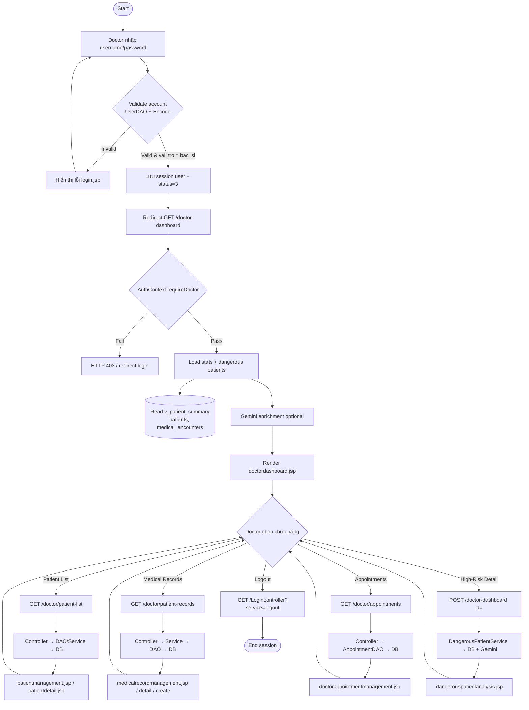

### PlantUML

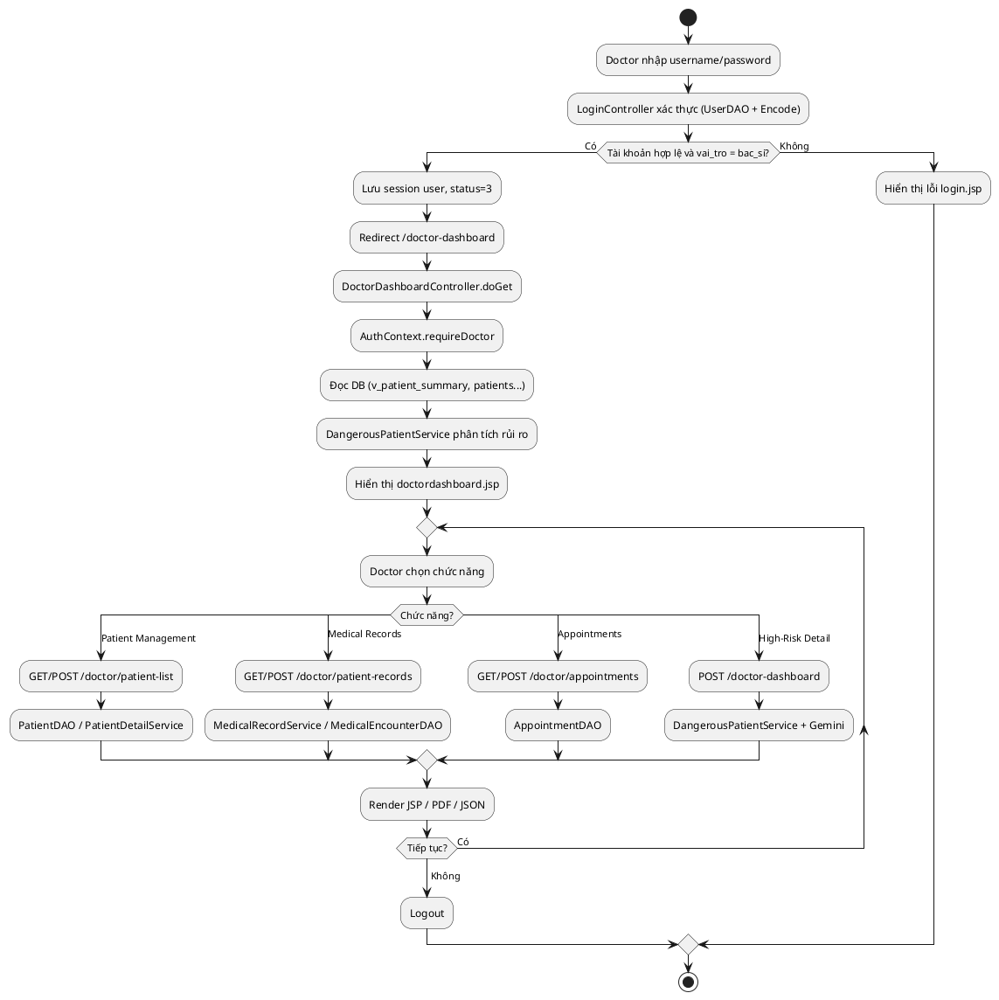

### Giải thích

| Mục | Nội dung |
|---|---|
| **Actor** | Doctor (`vai_tro = bac_si`) |
| **Trigger** | Truy cập `/Logincontroller`, submit form đăng nhập |
| **Main Flow** | Login → session → Dashboard → chọn module → Controller xử lý → hiển thị JSP/PDF/JSON |
| **Database Operation** | Read: `users`, `v_patient_summary`, `patients`, `medical_encounters`, `health_records`, `lab_results`, `prescriptions`, `medications`, `appointments`. Write: khi tạo encounter, treatment plan, cập nhật appointment |
| **Final Result** | Doctor thao tác trên dashboard, danh sách BN, hồ sơ khám, lịch hẹn, phân tích rủi ro |

---

## B. Doctor Module Swimlane Diagram (Tổng hợp)

### Mermaid

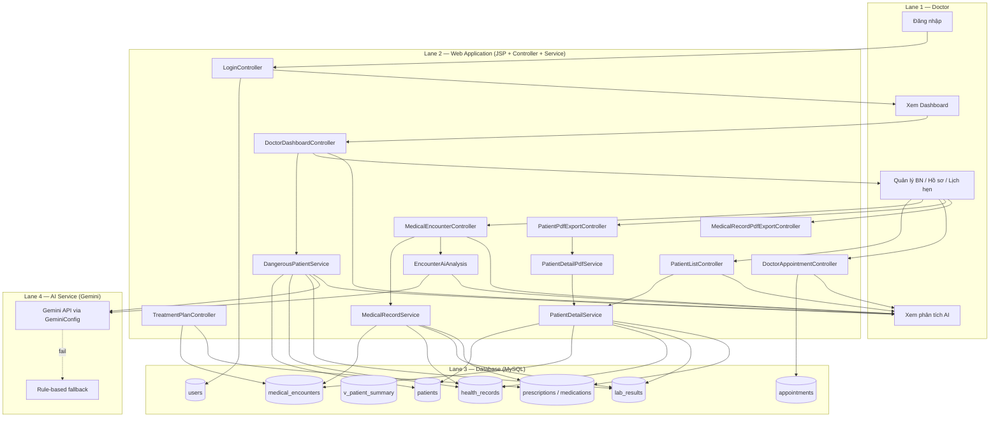

### PlantUML

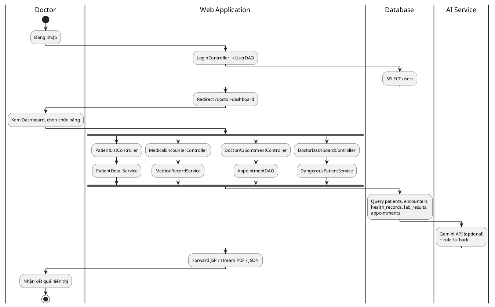

### Giải thích

| Mục | Nội dung |
|---|---|
| **Actor** | Doctor |
| **Trigger** | Mọi HTTP request tới servlet `/doctor-*` sau khi đăng nhập |
| **Main Flow** | Doctor tương tác JSP → Controller kiểm tra `AuthContext` → Service (nếu có) → DAO → DB; AI lane tham gia khi phân tích encounter hoặc BN nguy hiểm |
| **Database Operation** | JDBC qua `DBContext.getConnection()`; view `v_patient_summary` cho dashboard/filter |
| **Final Result** | HTML JSP, file PDF (`application/pdf`), hoặc JSON (`action=analyze`) |

---

## C. Swimlane Diagrams Chi Tiết

---

### C1. Patient Management Swimlane

#### Mermaid

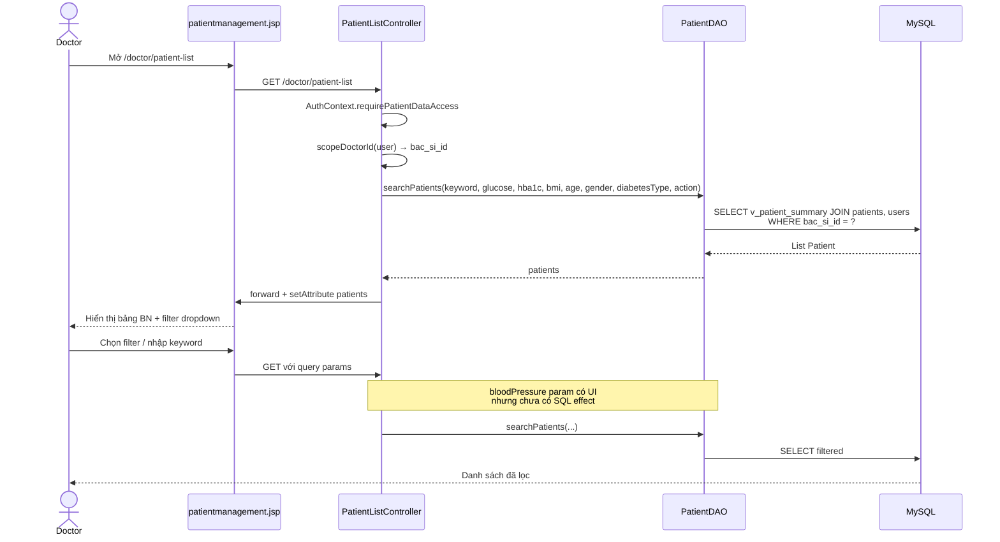

#### Giải thích

| Mục | Nội dung |
|---|---|
| **Actor** | Doctor (admin `quan_tri_vien` cũng truy cập được list) |
| **Trigger** | GET `/doctor/patient-list` |
| **Main Flow** | Load danh sách BN được gán (`patients.bac_si_id`) → áp dụng filter client → re-query |
| **Database Operation** | `SELECT` trên `v_patient_summary`, `patients`, `users` |
| **Final Result** | `patientmanagement.jsp` với danh sách và trạng thái filter |

**Filter đã implement:** keyword, glucose, HbA1c, BMI, age, gender, diabetesType, action (no-update / no-followup).  
**Chưa implement:** filter huyết áp (UI only).

---

### C2. Patient Detail & Medical Record View Swimlane

#### Mermaid

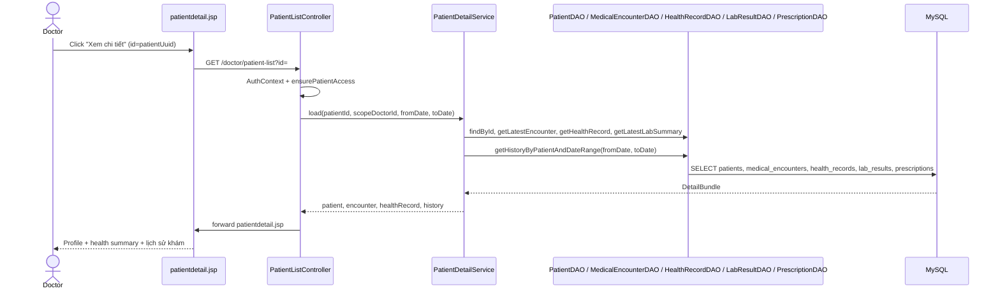

#### Giải thích

| Mục | Nội dung |
|---|---|
| **Actor** | Doctor |
| **Trigger** | GET `/doctor/patient-list?id={uuid}` hoặc POST cùng URL |
| **Main Flow** | `PatientDetailService.load()` tổng hợp profile, encounter mới nhất, health record, lab summary, prescription advice, history |
| **Database Operation** | Multi-table READ; history filter qua `MedicalEncounterDAO.getHistoryByPatientAndDateRange` |
| **Final Result** | Trang chi tiết BN với card thông tin và bảng lịch sử khám |

---

### C3. Medical History Filter Swimlane

#### Mermaid

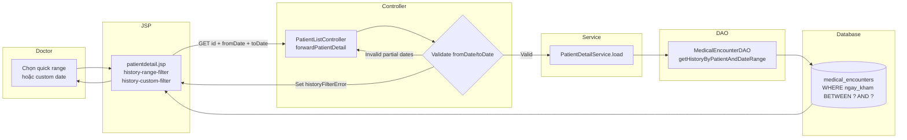

#### Giải thích

| Mục | Nội dung |
|---|---|
| **Actor** | Doctor |
| **Trigger** | Quick link GET hoặc submit form custom `fromDate`/`toDate` |
| **Main Flow** | Controller parse date → validate (cả hai hoặc không có) → resolve `activeQuickRange` → Service load history filtered |
| **Database Operation** | `SELECT medical_encounters WHERE benh_nhan_id = ? AND ngay_kham BETWEEN ? AND ?` |
| **Final Result** | Bảng lịch sử khám theo khoảng thời gian; empty state nếu không có bản ghi |

**Quick ranges:** 5 / 10 / 30 ngày (bao gồm hôm nay), Tất cả (không gửi date param).

---

### C4. PDF Medical Report Export Swimlane

#### Mermaid

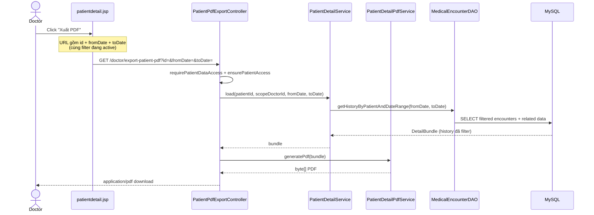

#### Giải thích

| Mục | Nội dung |
|---|---|
| **Actor** | Doctor |
| **Trigger** | GET `/doctor/export-patient-pdf?id=&fromDate=&toDate=` |
| **Main Flow** | Dùng **cùng** `PatientDetailService.load()` như trang detail → PDF chỉ chứa history đã filter |
| **Database Operation** | READ giống patient detail; **không** query full history khi có fromDate/toDate |
| **Final Result** | File PDF tải về (`patient-{code}-detail.pdf`) |

> **Lưu ý:** Nếu `fromDate > toDate`, controller reset cả hai về null (export toàn bộ).

---

### C5. Medical Encounter Management Swimlane

#### Mermaid

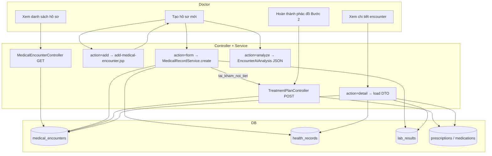

#### Giải thích

| Mục | Nội dung |
|---|---|
| **Actor** | Doctor |
| **Trigger** | GET/POST `/doctor/patient-records`, GET/POST `/doctor/treatment-plan` |
| **Main Flow** | List → Create (3 loại: nội tiết / CBC / sinh hóa) → optional AI analyze → save step 1 → treatment plan step 2 (chỉ nội tiết) |
| **Database Operation** | INSERT encounter + health_records/lab_results; UPDATE diagnosis/prescription ở step 2; DELETE cascade qua `action=delete` (backend only, **không có UI**) |
| **Final Result** | `medicalrecordmanagement.jsp`, `add-medical-encounter.jsp`, `medicalrecorddetail.jsp`, `treatment-plan.jsp` |

**Encounter types:** `tai_kham_noi_tiet`, `mau_tong_quat`, `sinh_hoa_mau`.

---

### C6. Laboratory Result Viewing Swimlane

#### Mermaid

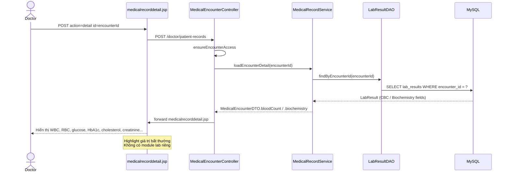

#### Giải thích

| Mục | Nội dung |
|---|---|
| **Actor** | Doctor |
| **Trigger** | Xem chi tiết encounter loại `mau_tong_quat` hoặc `sinh_hoa_mau` |
| **Main Flow** | Lab data gắn 1:1 với encounter (`lab_results.encounter_id` unique) |
| **Database Operation** | READ `lab_results`; WRITE khi tạo encounter (MedicalRecordService) |
| **Final Result** | Lab sections trong encounter detail; PDF export `type=blood` hoặc `type=biochemistry` |

**Không implement:** Quản lý lab độc lập, biểu đồ xu hướng lab theo thời gian.

---

### C7. Prescription / Treatment Plan Swimlane

#### Mermaid

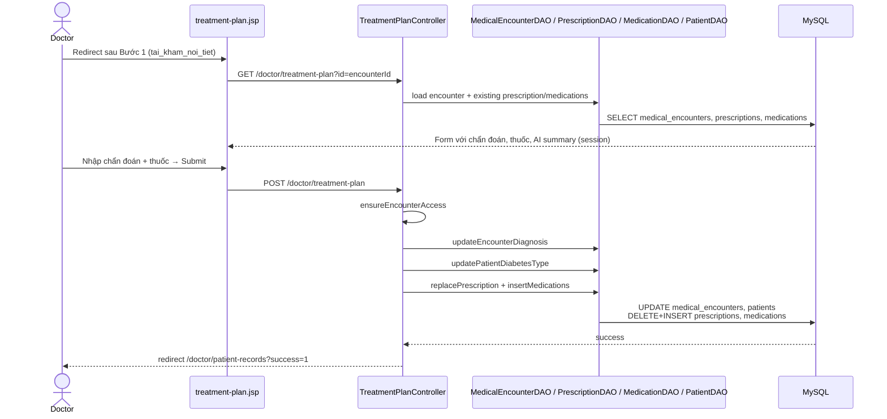

#### Giải thích

| Mục | Nội dung |
|---|---|
| **Actor** | Doctor |
| **Trigger** | GET/POST `/doctor/treatment-plan?id={encounterId}` sau khi tạo encounter nội tiết |
| **Main Flow** | Cập nhật chẩn đoán chính/phụ, hướng xử trí, phân loại tiểu đường, danh sách thuốc |
| **Database Operation** | UPDATE `medical_encounters`, `patients`; replace `prescriptions` + `medications` |
| **Final Result** | Đơn thuốc lưu DB; BN thấy advice trên patient dashboard qua prescription read |

**Không implement:** Workflow duyệt đơn, trang quản lý prescription độc lập.

---

### C8. AI Analysis & Monitoring Swimlane

#### Mermaid

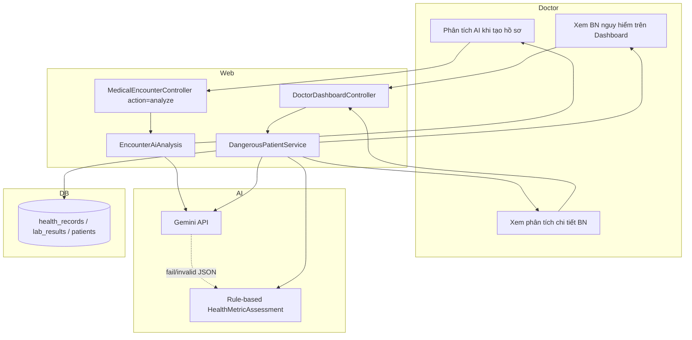

#### Giải thích

| Mục | Nội dung |
|---|---|
| **Actor** | Doctor |
| **Trigger** | AJAX `action=analyze` trên form tạo hồ sơ; load dashboard; POST drill-down BN nguy hiểm |
| **Main Flow** | Gemini phân tích chỉ số lâm sàng → fallback rule nếu lỗi; dashboard batch tối đa 20 BN + enrich Gemini |
| **Database Operation** | **Chỉ READ** — không lưu AI result vào DB (session `aiSummary:{encounterId}` cho treatment plan) |
| **Final Result** | JSON trên form create; cards trên dashboard; `dangerouspatientanalysis.jsp` |

**Không implement:** CRUD cảnh báo, cập nhật trạng thái alert, lưu persistent AI analysis, gửi notification.

---

### C9. Appointment Management Swimlane

#### Mermaid

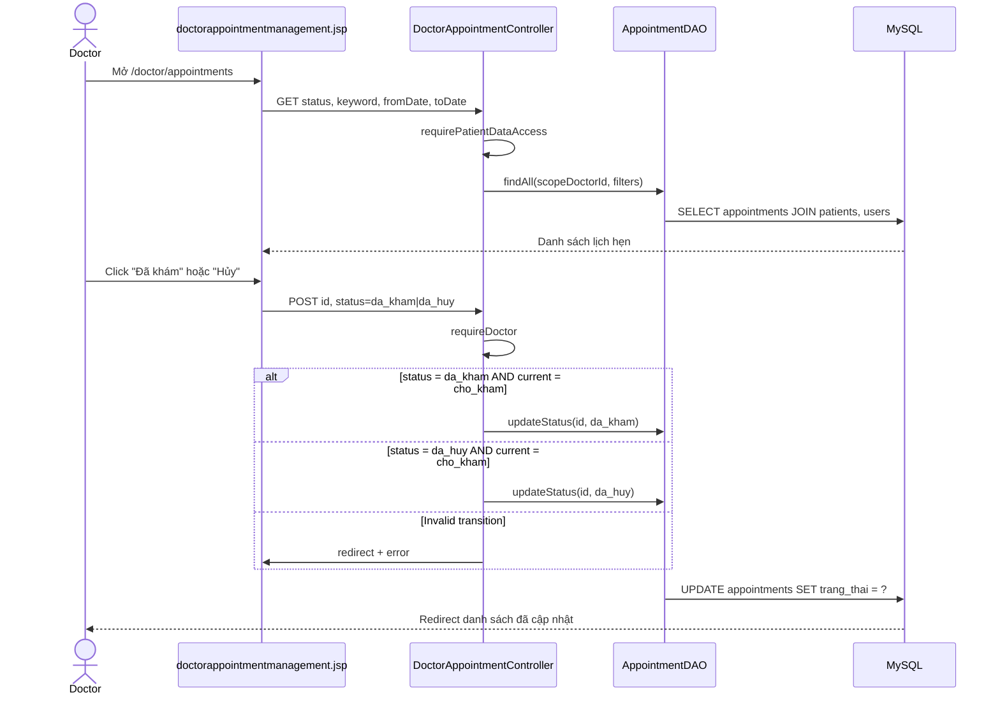

#### Giải thích

| Mục | Nội dung |
|---|---|
| **Actor** | Doctor |
| **Trigger** | GET/POST `/doctor/appointments` |
| **Main Flow** | Xem lịch → lọc theo status/keyword/date → đánh dấu hoàn thành hoặc hủy |
| **Database Operation** | SELECT + UPDATE `appointments.trang_thai` |
| **Final Result** | `doctorappointmentmanagement.jsp` với trạng thái mới |

**Không implement:** Approve/reject yêu cầu đặt lịch, tạo/reschedule lịch, filter `type` (UI only), thông báo patient.

**Trạng thái:** `cho_kham` → `da_kham` | `da_huy`.

---

### C10. High-Risk Patient Monitoring Swimlane

#### Mermaid

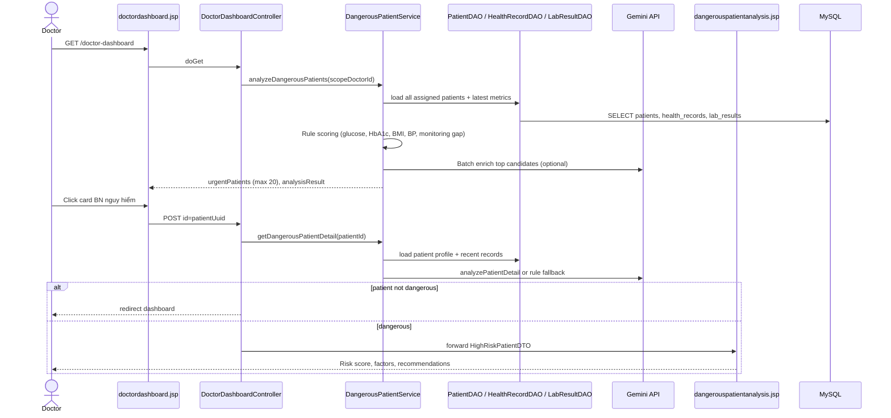

#### Giải thích

| Mục | Nội dung |
|---|---|
| **Actor** | Doctor |
| **Trigger** | Load dashboard; POST drill-down với `id` |
| **Main Flow** | Rule engine xếp hạng rủi ro → hiển thị top urgent → chi tiết AI/rule per patient |
| **Database Operation** | READ `patients`, `health_records`, `lab_results`, `v_patient_summary` |
| **Final Result** | Dashboard cards + trang `dangerouspatientanalysis.jsp` |

**Không implement:** URL `/doctor/high-risk` riêng, acknowledgment alert, scheduled monitoring job.

---

## Bảng Endpoint Tham Chiếu

| Chức năng | Method | URL | Controller | Service chính | DB Tables |
|---|---|---|---|---|---|
| Login | GET/POST | `/Logincontroller` | `LoginController` | — | `users` |
| Dashboard | GET | `/doctor-dashboard` | `DoctorDashboardController` | `DangerousPatientService` | `v_patient_summary`, `patients`, `medical_encounters` |
| High-risk detail | POST | `/doctor-dashboard` | `DoctorDashboardController` | `DangerousPatientService` | `patients`, `health_records`, `lab_results` |
| Patient list | GET | `/doctor/patient-list` | `PatientListController` | — | `v_patient_summary`, `patients`, `users` |
| Patient detail | GET/POST | `/doctor/patient-list?id=` | `PatientListController` | `PatientDetailService` | `patients`, `medical_encounters`, `health_records`, `lab_results`, `prescriptions` |
| Export patient PDF | GET | `/doctor/export-patient-pdf` | `PatientPdfExportController` | `PatientDetailService`, `PatientDetailPdfService` | (same as detail, filtered history) |
| Medical records list | GET | `/doctor/patient-records` | `MedicalEncounterController` | — | `medical_encounters`, `patients` |
| Create / AI / Detail | POST | `/doctor/patient-records?action=` | `MedicalEncounterController` | `MedicalRecordService`, `EncounterAiAnalysis` | `medical_encounters`, `health_records`, `lab_results` |
| Treatment plan | GET/POST | `/doctor/treatment-plan` | `TreatmentPlanController` | — | `medical_encounters`, `prescriptions`, `medications`, `patients` |
| Export encounter PDF | GET | `/doctor/record-export-pdf` | `MedicalRecordPdfExportController` | `MedicalRecordService`, PDF service | `medical_encounters` + related |
| Appointments | GET/POST | `/doctor/appointments` | `DoctorAppointmentController` | — | `appointments`, `patients`, `users` |

---

## Phụ lục — Chức năng KHÔNG implement (tránh mô tả sai trong báo cáo)

| Mục trong yêu cầu gốc | Thực tế trong hệ thống |
|---|---|
| Approve/Reject appointment | Chỉ **Mark Completed** (`da_kham`) và **Cancel** (`da_huy`) |
| Update alert status | Không có bảng/DAO alert; `canh_bao_chua_doc` chỉ đọc từ view |
| Manage Threshold Settings | Không có |
| Standalone Laboratory module | Lab nằm trong encounter create/detail |
| Standalone Prescription list | Chỉ qua Treatment Plan (Bước 2) |
| Delete medical record (UI) | Backend `action=delete` có; JSP chưa có nút x xóa |
| Sidebar Cảnh báo khẩn cấp / Phân tích dữ liệu | Placeholder, không có servlet |

---

*Tài liệu được sinh từ phân tích source tại `src/main/java/com/example/diabetesmanage/controller/doctor/` và JSP tương ứng. Cập nhật: 2026-07-20.*
