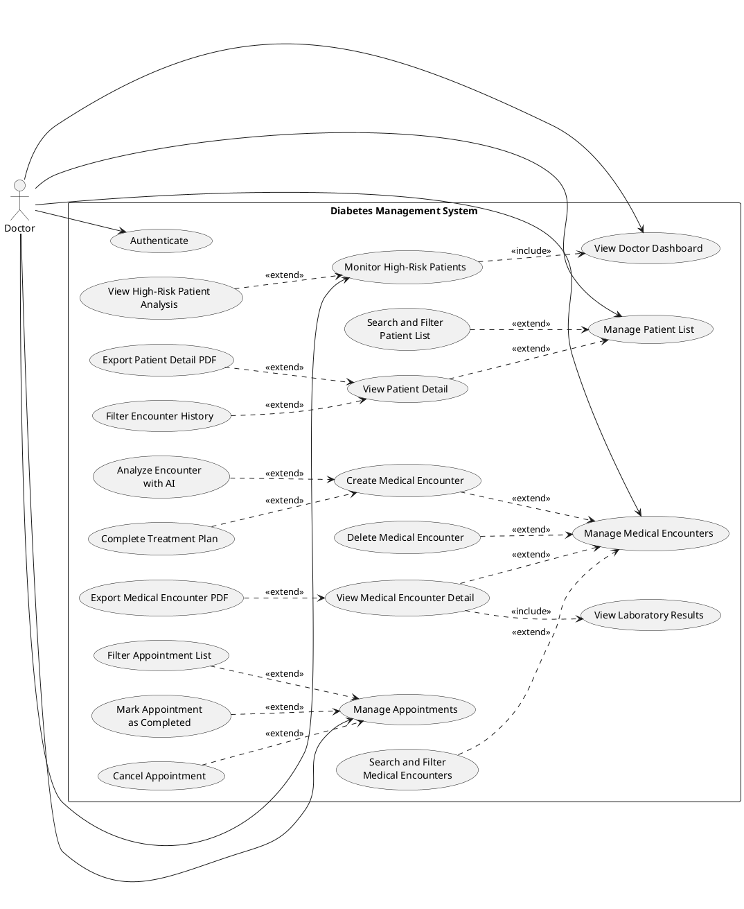
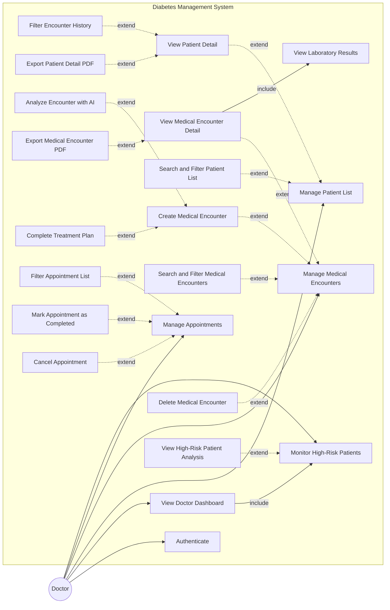
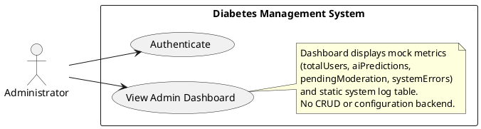
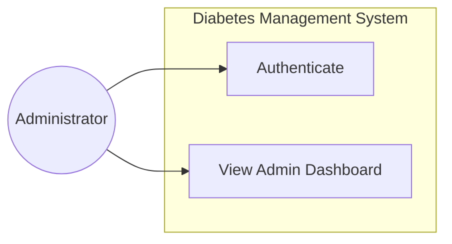

# Use Case Documentation — Diabetes Management System

> **Phiên bản:** 2.0 (cập nhật theo source code thực tế)  
> **Phạm vi:** Chức năng **đã triển khai** — không mô tả tính năng placeholder hoặc mock chưa có backend.  
> **Stack:** Jakarta Servlet, JSP, JDBC MySQL, Gemini AI (tùy chọn).

---

## E. Danh sách thay đổi (Change Log)

### Removed (không tồn tại trong hệ thống)

| ID cũ | Use Case cũ | Lý do |
|---|---|---|
| 02 | Review Patient Health Insight | Không có màn hình riêng; dữ liệu gộp trong **View Patient Detail** và **View High-Risk Patient Analysis** |
| 04 | Review Insulin Dosage | Chỉ hiển thị trong health record / patient detail, không có UC độc lập |
| 05 | Review Medication History | Xem qua **View Medical Encounter Detail** / **Complete Treatment Plan**, không có UC riêng |
| 12 | Review Cholesterol Results | Lab xem trong encounter detail, không tách module |
| 13 | Review Kidney Function Results | Lab xem trong encounter detail, không tách module |
| 14 | Analyze HbA1c Results | HbA1c hiển thị + AI phân tích tổng hợp, không có UC phân tích HbA1c riêng |
| 15 | Manage AI Alerts | Không có CRUD cảnh báo; chỉ **View High-Risk Alerts** trên dashboard |
| 16 | Manage AI Recommendation | AI chạy on-demand, không lưu DB, không có quản lý khuyến nghị |
| 17 | Manage Threshold Settings | **Chưa implement** (không servlet/DAO/UI backend) |

**Admin — Removed (toàn bộ nhóm chưa implement):**

- User Management (sidebar `href="#"`, không servlet)
- Doctor Assignment Management
- Medication Catalog Management
- Food Database Management
- Educational Content Management
- AI Configuration / Threshold Settings
- Data Moderation
- System Backup
- Push Notifications
- Reporting & Analytics (ngoài mock trên dashboard)

### Modified

| ID cũ | Trước | Sau |
|---|---|---|
| 01 | Manage Medical Record | Tách thành **Manage Medical Encounters** + các extend: Create, View Detail, Delete, Export PDF, AI Analyze, Complete Treatment Plan |
| 03 | Manage Prescriptions | **Complete Treatment Plan** (Bước 2 — cập nhật chẩn đoán + đơn thuốc sau khi tạo encounter) |
| 06 | Manage Patient List | Giữ + bổ sung extend **Search and Filter Patient List**, **View Patient Detail** |
| 07 | Manage Appointments | **View Appointment List** + filter; không tạo/sửa lịch mới |
| 08 | Approve Appointment Request | **Mark Appointment as Completed** (`cho_kham` → `da_kham`) |
| 09 | Reject Appointment Request | **Cancel Appointment** (`cho_kham` → `da_huy`) |
| 10 | View High-Risk Patient Dashboard | **Monitor High-Risk Patients** (dashboard + chi tiết phân tích) |
| 11 | Review Laboratory Results | **View Laboratory Results** (<<include>> trong View Medical Encounter Detail) |

### Added

| ID mới | Use Case | Endpoint / bằng chứng code |
|---|---|---|
| D01 | Authenticate | `LoginController`, `AuthContext` |
| D07 | View Patient Detail | `GET/POST /doctor/patient-list?id=` |
| D08 | Search and Filter Patient List | `PatientDAO.searchPatients` — glucose, HbA1c, BMI, BP, age, gender, diabetes type |
| D09 | Filter Encounter History | `fromDate`/`toDate` — quick 5/10/30 ngày + custom |
| D10 | Export Patient Detail PDF | `GET /doctor/export-patient-pdf` |
| D12 | Create Medical Encounter | `POST /doctor/patient-records?action=form` |
| D13 | Analyze Encounter with AI | `POST /doctor/patient-records?action=analyze` (AJAX, Gemini/rule-based) |
| D14 | View Medical Encounter Detail | `POST /doctor/patient-records?action=detail` |
| D15 | Delete Medical Encounter | `POST /doctor/patient-records?action=delete` |
| D16 | Export Medical Encounter PDF | `GET /doctor/record-export-pdf?type=` |
| D17 | Complete Treatment Plan | `GET/POST /doctor/treatment-plan` |
| D18 | Search and Filter Medical Encounters | `MedicalEncounterDAO.searchEncounters` |
| D19 | Filter Appointment List | `AppointmentDAO.findAll` — status, keyword, date |
| D20 | View High-Risk Patient Analysis | `POST /doctor-dashboard` → `dangerouspatientanalysis.jsp` |
| A01 | View Admin Dashboard | `GET /admin-dashboard` (mock metrics + log table) |
| A02 | Authenticate (Admin) | `LoginController` → role `quan_tri_vien` |

---

## A. Doctor Use Case Diagram (PlantUML)

### Doctor Use Case Diagram (Mermaid)

---

## C. Doctor Use Case Description Table

| ID | Feature | Use Case | Use Case Description |
|---|---|---|---|
| D01 | Authentication & Authorization | **Authenticate** | Doctor signs in with email/username and password through `LoginController`. The system validates credentials against the `users` table, creates an HTTP session storing the `User` object, verifies role `bac_si`, and redirects to `/doctor-dashboard`. Unauthorized roles receive HTTP 403 on doctor-only endpoints. Doctor logs out via `Logincontroller?service=logout`, which invalidates the session. |
| D02 | Dashboard Management | **View Doctor Dashboard** | Doctor views the operational dashboard at `/doctor-dashboard` showing total assigned patients, glucose risk distribution (low/medium/high/critical thresholds), active alert count, and today's encounter count sourced from `v_patient_summary` and `DoctorDashboardDAO`. Optional date range filters (`startDate`, `endDate`) refine statistics. The dashboard also lists high-risk patients ranked by computed risk score. |
| D03 | High-Risk Monitoring | **Monitor High-Risk Patients** | Doctor reviews patients flagged as dangerous based on rule-engine scoring (`DangerousPatientService`) using latest health records: abnormal glucose, HbA1c, blood pressure, BMI, monitoring gaps, glucose trends, and insulin ineffectiveness. The system optionally enriches results with Gemini AI summaries. Up to 20 urgent alerts display on the dashboard with risk level, vital signs, and AI insight when available. |
| D04 | High-Risk Monitoring | **View High-Risk Patient Analysis** | Doctor selects a high-risk patient from the dashboard and submits POST to `/doctor-dashboard` with patient ID. The system verifies doctor ownership via `ensurePatientAccess`, loads full risk profile and recent health records, runs detailed Gemini analysis (or rule-based fallback), and displays `dangerouspatientanalysis.jsp` with metric badges, AI summary, recommendations, and follow-up history. |
| D05 | Patient List Management | **Manage Patient List** | Doctor opens `/doctor/patient-list` to view all patients assigned to the logged-in doctor (`patients.bac_si_id`). Each row shows patient code, name, latest glucose, HbA1c, BMI, risk level, and last measurement time aggregated from `v_patient_summary`. Admin users (`quan_tri_vien`) may view all patients when accessing the same endpoint. |
| D06 | Patient List Management | **Search and Filter Patient List** | Doctor applies multi-criteria filters on the patient list: keyword (name, email, patient code), glucose level category (normal/high/critical/missing), HbA1c category, BMI category, blood pressure category, age group, gender, and diabetes type. Filters are passed as GET parameters and translated into dynamic SQL conditions in `PatientDAO.searchPatients`. |
| D07 | Patient Detail Management | **View Patient Detail** | Doctor opens patient detail via GET/POST `/doctor/patient-list?id={patientId}` to review assigned patient profile including personal demographics, diabetes classification, emergency contacts, insurance, allergies, and aggregated clinical summary. The system loads latest encounter, merged health record (vitals, symptoms, diagnoses, lifestyle data), and lab summaries from `PatientDetailService`. |
| D08 | Medical Encounter History | **Filter Encounter History** | On the patient detail page, doctor filters encounter history using a dropdown: all history, last 5/10/30 days (inclusive, server-computed date range), or custom from/to dates. Parameters `fromDate` and `toDate` are sent to `PatientListController`, parsed as `LocalDate`, validated, and passed to `MedicalEncounterDAO.getHistoryByPatientAndDateRange` with SQL `DATE(ngay_kham) BETWEEN ? AND ?`. Filtered results render in the history table only; no client-side filtering. |
| D09 | Patient Detail Management | **Export Patient Detail PDF** | Doctor clicks Export PDF on patient detail. The system calls `/doctor/export-patient-pdf?id=&fromDate=&toDate=` using the same date filter as the on-screen history. `PatientDetailPdfService` generates an OpenPDF document containing patient demographics, health record summary, and encounter history title reflecting the active filter range. |
| D10 | Medical Record Management | **Manage Medical Encounters** | Doctor accesses `/doctor/patient-records` to list all medical encounters scoped to assigned patients. The list shows encounter date, patient, record type (endocrine follow-up, CBC, biochemistry), diagnosis, and status. Doctor can navigate to create, view, or delete encounters from this module. |
| D11 | Medical Record Management | **Search and Filter Medical Encounters** | Doctor filters the encounter list by date range (`startDate`, `endDate`), keyword, encounter type (`tai_kham_noi_tiet`, `mau_tong_quat`, `sinh_hoa_mau`), status, and specific `patientId`. Filters are applied in `MedicalEncounterDAO.searchEncounters` at database level. |
| D12 | Medical Record Management | **Create Medical Encounter** | Doctor opens the create form (`action=add`) and submits Step 1 (`action=form`) with patient, visit date, encounter type, and type-specific data (vitals/labs). `MedicalRecordService.validateStep1` validates input; `create()` runs a JDBC transaction inserting into `medical_encounters` and related tables (`health_records`, `lab_results`, and placeholder prescription for endocrine type). Endocrine encounters redirect to treatment plan Step 2; lab-only encounters redirect to the encounter list. |
| D13 | AI Analysis | **Analyze Encounter with AI** | Before saving an encounter, doctor triggers AJAX POST `action=analyze`. The system sends form vitals and lab values to `EncounterAiAnalysis`, which calls Gemini API with a structured JSON schema or falls back to rule-based clinical scoring. JSON result (risk level, score, factors, recommendations) returns to the browser without persisting to database. |
| D14 | Medical Record Management | **View Medical Encounter Detail** | Doctor submits `action=detail` with encounter ID. `MedicalRecordService.loadMedicalRecordDetail` assembles `MedicalEncounterDTO` with patient info, internal medicine section, prescription, CBC, and biochemistry panels. Results render on `medicalrecorddetail.jsp` with section-specific PDF export links. |
| D15 | Laboratory Result Management | **View Laboratory Results** | Included when viewing encounter detail. Doctor reviews CBC metrics (WBC, RBC, HGB, HCT, PLT) and biochemistry metrics (glucose, HbA1c, cholesterol, triglycerides, liver/kidney function) loaded from `lab_results` and mapped into the detail view. No standalone laboratory module exists. |
| D16 | Medical Record Management | **Delete Medical Encounter** | Doctor submits `action=delete` with encounter ID. The system verifies access, then deletes related records in a transaction: medications, prescriptions, lab results, health records, and the encounter row from `medical_encounters`. Redirect confirms deletion via PRG pattern. |
| D17 | Medical Record Management | **Export Medical Encounter PDF** | Doctor exports a single encounter PDF via `/doctor/record-export-pdf?id=&type=` where type is `full`, `internal`, `prescription`, `blood`, or `biochemistry`. `MedicalRecordPdfService` renders the selected sections into a downloadable PDF file. |
| D18 | Prescription Management | **Complete Treatment Plan** | After creating an endocrine encounter (Step 1), doctor completes Step 2 at `/doctor/treatment-plan`. Doctor enters primary/secondary diagnosis, treatment direction, and medication lines (dosage, frequency, duration). The system validates input, updates `medical_encounters`, replaces prescription and medication rows in a transaction, and updates patient diabetes type if provided. |
| D19 | Appointment Management | **Manage Appointments** | Doctor views appointment list at `/doctor/appointments` showing patient name, scheduled time, appointment type, and status (`cho_kham`, `da_kham`, `da_huy`) for assigned patients via `AppointmentDAO.findAll`. |
| D20 | Appointment Management | **Filter Appointment List** | Doctor filters appointments by status, keyword (patient name/code), date range (`fromDate`, `toDate`), and record type (UI parameter; SQL type filter not yet applied). Filtered results reload the appointment management page. |
| D21 | Appointment Management | **Mark Appointment as Completed** | Doctor marks a pending appointment (`cho_kham`) as completed via POST with `status=da_kham`. `AppointmentDAO.updateStatus` updates the row after verifying doctor scope and current status. |
| D22 | Appointment Management | **Cancel Appointment** | Doctor cancels a pending appointment via POST with `status=da_huy`. System validates the appointment belongs to the doctor's patients and updates status in the database. |

---

## B. Admin Use Case Diagram (PlantUML)

> **Lưu ý:** Module Admin hiện chỉ triển khai dashboard mock. Sidebar admin (user management, medication catalog, AI config, backup, notifications) **không có backend**.

### Admin Use Case Diagram (Mermaid)

---

## D. Admin Use Case Description Table

| ID | Feature | Use Case | Use Case Description |
|---|---|---|---|
| A01 | Authentication | **Authenticate** | Administrator signs in through the shared `LoginController` with role `quan_tri_vien`. On success, session stores the `User` object and redirects to `/admin-dashboard`. Logout invalidates the session via `Logincontroller?service=logout`. |
| A02 | System Monitoring | **View Admin Dashboard** | Administrator opens `/admin-dashboard` to view system overview cards: total users, AI predictions today, pending moderation count, and system error count. Values are **mock data** set in `AdminDashboardServlet`, not queried from database. A static system log table displays sample log entries (timestamp, severity, event, actor, IP). Sidebar menu items (account management, medication catalog, AI configuration, backup, notifications) are UI placeholders with `href="#"` and have **no implemented use cases**. |

### Admin — Cross-cutting note (implemented indirectly)

| Capability | Status | Evidence |
|---|---|---|
| Access patient data (read-only, all doctors) | Partial | `AuthContext.requirePatientDataAccess` allows admin; `scopeDoctorId=null` in DAOs — **no dedicated admin UI** for patient/encounter management |
| User Management | Not implemented | No servlet/DAO |
| Medication Catalog | Not implemented | Medications created per-encounter only |
| Food Database | Not implemented | — |
| Educational Content | Not implemented | — |
| Reporting & Analytics | Mock only | Dashboard hardcoded metrics |
| Threshold / AI Settings | Not implemented | Rule thresholds hardcoded in Java services |

---

## Mapping: Yêu cầu nghiệp vụ → Use Case thực tế

| Yêu cầu nghiệp vụ | Use Case trong tài liệu | Trạng thái |
|---|---|---|
| Doctor xem danh sách bệnh nhân | D05 Manage Patient List | ✅ |
| Doctor tìm kiếm/lọc theo chỉ số sức khỏe | D06 Search and Filter Patient List | ✅ |
| Doctor xem hồ sơ bệnh nhân | D07 View Patient Detail | ✅ |
| Doctor xem lịch sử khám | D08 Filter Encounter History (within D07) | ✅ |
| Doctor xem kết quả xét nghiệm | D15 View Laboratory Results (include D14) | ✅ |
| Doctor quản lý bệnh án | D10–D17 Manage Medical Encounters | ✅ |
| Doctor tạo/quản lý đơn thuốc | D18 Complete Treatment Plan | ✅ (Step 2) |
| Doctor theo dõi AI risk analysis | D03, D04, D13 | ✅ (on-demand, không lưu DB) |
| Doctor xử lý cảnh báo sức khỏe | D03 Monitor High-Risk Patients | ✅ (xem, không quản lý CRUD) |
| Doctor quản lý lịch hẹn | D19–D22 | ✅ (xem + đổi trạng thái) |

---

## Review bảng 17 mục cũ (Doctor)

| # | Mục cũ | Quyết định | Use Case mới |
|---|---|---|---|
| 01 | Manage Medical Record | **MODIFY** | D10–D17 (tách encounter lifecycle) |
| 02 | Review Patient Health Insight | **REMOVE** | Gộp D07, D04 |
| 03 | Manage Prescriptions | **MODIFY** | D18 Complete Treatment Plan |
| 04 | Review Insulin Dosage | **REMOVE** | Trong D07 health record |
| 05 | Review Medication History | **REMOVE** | Trong D14, D18 |
| 06 | Manage Patient List | **KEEP/MODIFY** | D05 + D06 |
| 07 | Manage Appointments | **MODIFY** | D19 View + D20 Filter |
| 08 | Approve Appointment Request | **MODIFY** | D21 Mark as Completed |
| 09 | Reject Appointment Request | **MODIFY** | D22 Cancel Appointment |
| 10 | View High-Risk Dashboard | **KEEP/MODIFY** | D02 + D03 |
| 11 | Review Laboratory Results | **MODIFY** | D15 (include D14) |
| 12 | Review Cholesterol | **REMOVE** | Trong D15 |
| 13 | Review Kidney Function | **REMOVE** | Trong D15 |
| 14 | Analyze HbA1c | **REMOVE** | Trong D13 AI + D15 display |
| 15 | Manage AI Alerts | **REMOVE** | D03 (view only) |
| 16 | Manage AI Recommendation | **REMOVE** | D13 (on-demand) |
| 17 | Manage Threshold Settings | **REMOVE** | Chưa implement |

---

*Tài liệu này phản ánh source tại thời điểm cập nhật. Tham chiếu chi tiết kỹ thuật: [`Doctor-Module-Documentation.md`](Doctor-Module-Documentation.md).*
